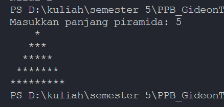

# Pertemuan 3
## Guided
### Pengenalan Dart

1. **Variabel**

2. **IF-ELSE & SWITCH CASE**

3. **Looping**

4. **List**

5. **Fungsi**

## Unguided
#### 1. Soal 1
Kode:

Output:

Penjelasan:
Pertama sistem akan meminta input dari user, kemudian hasil input akan diterima lalu diubah menjadi tipe data int. Kemudian fungsi gradeChecker() dipanggil untuk memeriksa nilai yang diterima. terdapat beberapa kondisi untuk sebuah nilai mendapatkan grade tertentu.

#### 2. Soal 2
Kode:

Output:

Penjelasan:
Pertama sistem akan meminta input dari user, kemudian hasil input akan diterima lalu diubah menjadi tipe data int. Tinggi piramida berdasarkan inputan user, misalnya user menginput 5 maka tinggi piramida adalah 5. Untuk membuat tinggi piramida, kita bisa menggunaka for loops. Untuk membuat pola bintang ganjil seperti di gambar, kita bisa menggunakan rumus:
\[
\text{Jumlah bintang} = n + 1
\]
- **n** = iterasi

Jadi iterasi akan dimulai dari 0 sehingga pada pola pertama dibentung 1 bintang, itersi kedua adalah 1 sehingg pola kedua adalah 3 bintang, dst.

#### 3. Soal 3
Kode:

Output:

Penjelasan:
Pertama sistem akan meminta input dari user, kemudian hasil input akan diterima lalu diubah menjadi tipe data int. Kemudian kita memanggil fungsi checkPrima() untuk mengecek apakah inputan merupakan bilangan prima. Sistem akan memeriksa jika angka kurang dari sama dengan 1, berarti bilangan tersebut bukan bilangan prima. kemudian sistem akan melakukan for loops dimulai dari angka 2 hingga bilangan inputan. misalnya menginput 7 maka terjadi looping dari bilangan 2 hingga 6. Bilangan inputan akan dicari sisa bagi dengan tiap bilangan yang akan dibagi, jika sisanya adalah 0 maka bilangan tersebut bukan bilangan prima. Jika return dari 2 sistem di atas tidak terjadi, maka bilangan tersebut adalah bilangan prima.