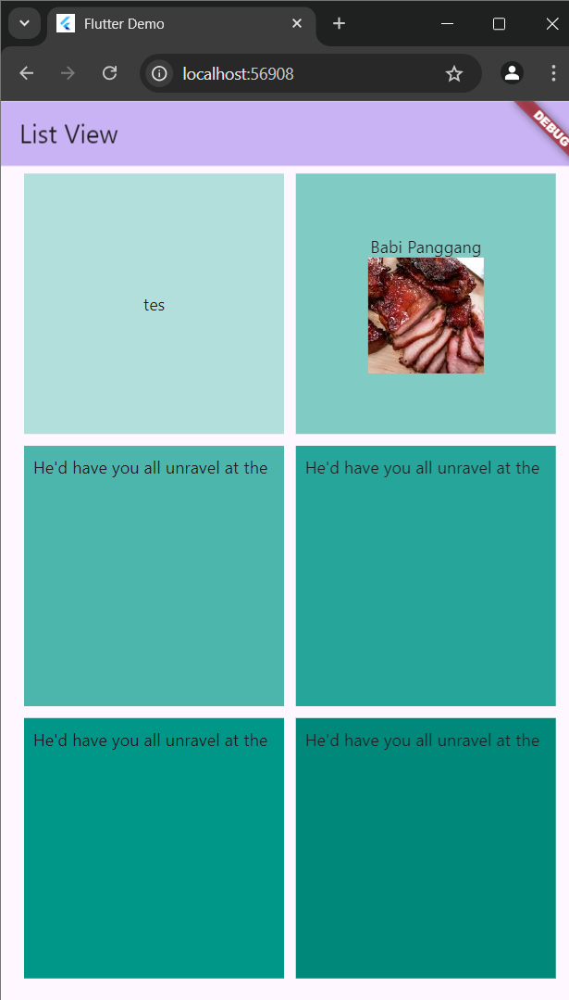
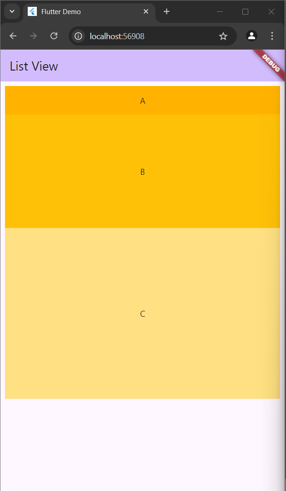
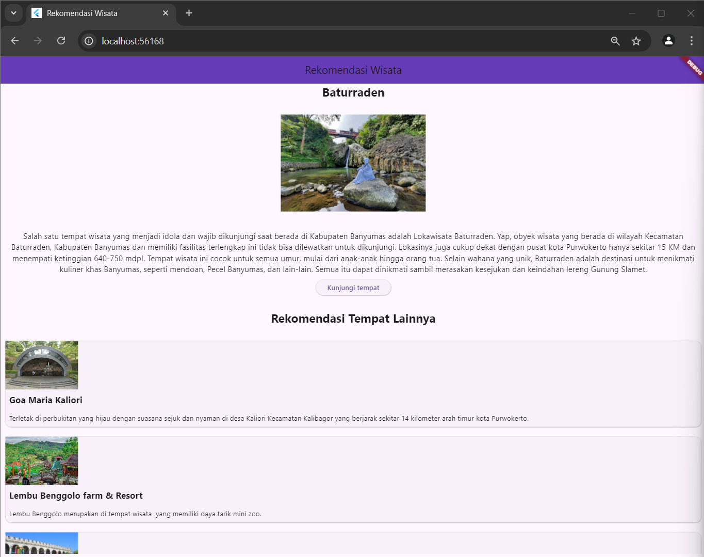

# Pertemuan 4

## Guided

### Pengenalan widged

1. **GridView Widget**
    
    Code:
    ```
    import 'package:flutter/material.dart';
    import 'package:praktikum_4/list_view.dart';


    void main() {
    runApp(const MyApp());
    }

    class MyApp extends StatelessWidget {
    const MyApp({super.key});

    // This widget is the root of your application.
    @override
    Widget build(BuildContext context) {
        return MaterialApp(
        title: 'Flutter Demo',
        theme: ThemeData(
            colorScheme: ColorScheme.fromSeed(seedColor: Colors.deepPurple),
            useMaterial3: true,
        ),
        home: MyHomePage(title: "List View"),
        );
    }
    }

    class MyHomePage extends StatefulWidget {
    const MyHomePage({super.key, required this.title});

    final String title;

    @override
    State<MyHomePage> createState() => _MyHomePageState();
    }

    class _MyHomePageState extends State<MyHomePage> {
    @override
    Widget build(BuildContext context) {
        return Scaffold(
        appBar: AppBar(
            backgroundColor: Theme.of(context).colorScheme.inversePrimary,
            title: Text(widget.title),
        ),
        body: Center(
            child: GridView.count(
                primary: false,
                padding: const EdgeInsets.all(20),
                crossAxisSpacing: 10,
                mainAxisSpacing: 10,
                crossAxisCount: 2,
                children: <Widget>[
                Container(
                    padding: const EdgeInsets.all(8),
                    color: Colors.teal[100],
                    child: const Center(
                    child: Column(
                        mainAxisAlignment: MainAxisAlignment.center,
                        children: <Widget>[
                            Text("tes"),
                        ]),
                    ),
                ),
                Container(
                    padding: const EdgeInsets.all(8),
                    color: Colors.teal[200],
                    child: Center(
                    child: Column(
                        mainAxisAlignment: MainAxisAlignment.center,
                        children: <Widget>[
                        Text("Babi Panggang"),
                        Image.network(
                            'https://encrypted-tbn0.gstatic.com/images?q=tbn:ANd9GcRvTZV-07C9QM-IAyrENxujTrWPk9XPLgP_xA&s',
                            width: 100,
                            height: 100,
                            fit: BoxFit.cover,
                        ),
                        ],
                    ),
                    ),
                ),
                Container(
                    padding: const EdgeInsets.all(8),
                    child: const Text("He'd have you all unravel at the"),
                    color: Colors.teal[300],
                ),
                Container(
                    padding: const EdgeInsets.all(8),
                    child: const Text("He'd have you all unravel at the"),
                    color: Colors.teal[400],
                ),
                Container(
                    padding: const EdgeInsets.all(8),
                    child: const Text("He'd have you all unravel at the"),
                    color: Colors.teal[500],
                ),
                Container(
                    padding: const EdgeInsets.all(8),
                    child: const Text("He'd have you all unravel at the"),
                    color: Colors.teal[600],
                ),
                ]
            ),
        ),
        );
    }
    }
    ```

2. **ListView Widget**
    
    Code main:
    ```
    void main() {
        runApp(const MyApp());
    }

    class MyApp extends StatelessWidget {
        const MyApp({super.key});

    // This widget is the root of your application.
    @override
    Widget build(BuildContext context) {
        return MaterialApp(
            title: 'Flutter Demo',
                theme: ThemeData(
                    colorScheme: ColorScheme.fromSeed(seedColor: Colors.deepPurple),
                useMaterial3: true,
                ),
            # Ubah di sini menjadi ListViewApp agar menampilkan ListView dari file lain
            home: ListViewApp(title: "List View"), 
            );
        }
    }
    ```
    Code ListView:
    ```
    import 'package:flutter/material.dart';

    void main() {
    runApp(const MyApp());
    }

    class MyApp extends StatelessWidget {
    const MyApp({super.key});

    // This widget is the root of your application.
    @override
    Widget build(BuildContext context) {
        return MaterialApp(
        title: 'Flutter Demo',
        theme: ThemeData(
            colorScheme: ColorScheme.fromSeed(seedColor: Colors.deepPurple),
            useMaterial3: true,
        ),
        home: const ListViewApp(title: 'Flutter Demo Home Page'),
        );
    }
    }

    class ListViewApp extends StatefulWidget {
    const ListViewApp({super.key, required this.title});

    final String title;

    @override
    State<ListViewApp> createState() => _MyHomePageState();
    }

    class _MyHomePageState extends State<ListViewApp> {
    @override
    Widget build(BuildContext context) {
        return Scaffold(
        appBar: AppBar(
            backgroundColor: Theme.of(context).colorScheme.inversePrimary,
            title: Text(widget.title),
        ),
        body: Center(
            child: ListView(
            padding: const EdgeInsets.all(8),
            children: <Widget>[
                Container(
                height: 50,
                color: Colors.amber[600],
                child: const Center(child: Text("A"),),
                ),
                Container(
                height: 200,
                color: Colors.amber[500],
                child: const Center(
                    child: Text("B"),
                ),
                ),
                Container(
                height: 300,
                color: Colors.amber[200],
                child: const Center(
                    child: Text("C"),
                ),
                ),
            ],
            )
        ),
        );
    }
    }
    ```

## Unguided

Memodifikasi TP sehingga terdapat ListView
Tampilan:

Code:
```
import 'package:flutter/material.dart';

void main() {
  runApp(const MyApp());
}

class MyApp extends StatelessWidget {
  const MyApp({super.key});

  @override
  Widget build(BuildContext context) {
    return MaterialApp(
      title: 'Rekomendasi Wisata',
      theme: ThemeData(
        colorScheme: ColorScheme.fromSeed(seedColor: Colors.deepPurple),
        useMaterial3: true,
      ),
      home: const MyHomePage(title: 'Rekomendasi Wisata'),
    );
  }
}

class MyHomePage extends StatefulWidget {
  const MyHomePage({super.key, required this.title});

  final String title;

  @override
  State<MyHomePage> createState() => _MyHomePageState();
}

class _MyHomePageState extends State<MyHomePage> {
  final List<Map<String, String>> places = [
    {
      'name': 'Goa Maria Kaliori',
      'description':
          'Terletak di perbukitan yang hijau dengan suasana sejuk dan nyaman di desa Kaliori Kecamatan Kalibagor yang berjarak sekitar 14 kilometer arah timur kota Purwokerto.',
      'image':
          'https://dolanbanyumas.banyumaskab.go.id/assets/gambar_objek/goa-maria-kaliori.jpg'
    },
    {
      'name': 'Lembu Benggolo farm & Resort',
      'description':
          'Lembu Benggolo merupakan di tempat wisata  yang memiliki daya tarik mini zoo.',
      'image':
          'https://dolanbanyumas.banyumaskab.go.id/assets/gambar_objek/lembu-benggolo-farm-resort.jpg'
    },
    {
      'name': 'Depo Bay',
      'description':
          'Wisata renang yang terbuka untuk umum yang berada di Depo Pelita Sokaraja.',
      'image':
          'https://dolanbanyumas.banyumaskab.go.id/assets/gambar_objek/depo-bay.jpg'
    },
    {
      'name': 'Taman Botani',
      'description':
          'Taman Botani menyajikan bermacam jenis tanaman hias bunga anggrek yang menjadi sarana edukasi mengenal tanaman hias dengan berbagai keunikannya.',
      'image':
          'https://dolanbanyumas.banyumaskab.go.id/assets/gambar_objek/taman-botani.png'
    },
    {
      'name': 'Sukan River Tubing',
      'description': 
          'Sukan River Tubing adalah sebuah olahraga air dengan memanfaatkan aliran sungai irigasi yang bernama Kali Sukan.',
      'image': 
          'https://dolanbanyumas.banyumaskab.go.id/assets/gambar_objek/sukan-river-tubing.jpg'
    },
  ];

  @override
  Widget build(BuildContext context) {
    return Scaffold(
      appBar: AppBar(
        backgroundColor: Colors.deepPurple,
        title: Text(widget.title),
        centerTitle: true,
      ),
      body: SingleChildScrollView(
        child: Column(
          children: [
            Container(
              child: Center(
                child: Text(
                  "Baturraden",
                  style: TextStyle(
                    fontSize: 24,
                    fontWeight: FontWeight.bold,
                  ),
                ),
              ),
            ),
            Container(
              padding: EdgeInsets.all(30),
              child: Image.network(
                "https://visitjawatengah.jatengprov.go.id/assets/images/2a2f08e2-8100-4da7-98ed-b8919535bbc8.jpg",
                width: 300,
                height: 200,
                fit: BoxFit.cover,
              ),
            ),
            Container(
              padding: EdgeInsets.all(10),
              child: Text(
                "Salah satu tempat wisata yang menjadi idola dan wajib dikunjungi saat berada di Kabupaten Banyumas adalah Lokawisata Baturraden. Yap, obyek wisata yang berada di wilayah Kecamatan Baturraden, Kabupaten Banyumas dan memiliki fasilitas terlengkap ini tidak bisa dilewatkan untuk dikunjungi. Lokasinya juga cukup dekat dengan pusat kota Purwokerto hanya sekitar 15 KM dan menempati ketinggian 640-750 mdpl. Tempat wisata ini cocok untuk semua umur, mulai dari anak-anak hingga orang tua. Selain wahana yang unik, Baturraden adalah destinasi untuk menikmati kuliner khas Banyumas, seperti mendoan, Pecel Banyumas, dan lain-lain. Semua itu dapat dinikmati sambil merasakan kesejukan dan keindahan lereng Gunung Slamet.",
                textAlign: TextAlign.center,
                style: TextStyle(fontSize: 16),
              ),
            ),
            
            Container(
              margin: EdgeInsets.only(bottom: 30),
              child: ElevatedButton(
                onPressed: () {
                  ScaffoldMessenger.of(context).showSnackBar(
                    const SnackBar(content: Text("Menuju ke Baturraden")));
                  },
                child: const Text("Kunjungi tempat")
              ),
            ),
            Container(
              margin: EdgeInsets.only(bottom: 20),
              child: Text(
                "Rekomendasi Tempat Lainnya",
                style: TextStyle(
                  fontSize: 24,
                  fontWeight: FontWeight.bold,
                ),
              ),
            ),

            Container(
              height: 450,
              child: ListView.builder(
                scrollDirection: Axis.vertical,
                itemCount: places.length,
                itemBuilder: (context, index) {
                  return Card(
                    margin: const EdgeInsets.all(10),
                    child: Column(
                      crossAxisAlignment: CrossAxisAlignment.start,
                      children: [
                        Image.network(
                          places[index]['image']!,
                          width: 150,
                          height: 100,
                          fit: BoxFit.cover,
                        ),
                        Padding(
                          padding: const EdgeInsets.all(8.0),
                          child: Text(
                            places[index]['name']!,
                            style: const TextStyle(
                              fontSize: 18,
                              fontWeight: FontWeight.bold,
                            ),
                          ),
                        ),
                        Padding(
                          padding: const EdgeInsets.all(8.0),
                          child: Text(
                            places[index]['description']!,
                            style: const TextStyle(fontSize: 14),
                          ),
                        ),
                      ],
                    ),
                  );
                },
              ),
            ),
          ],
        ),
      ),
    );
  }
}
```