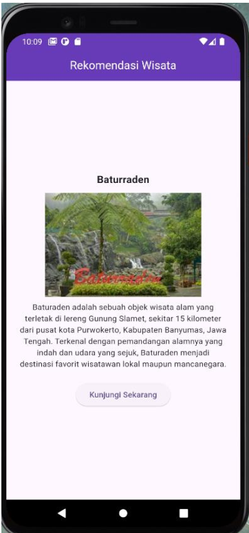
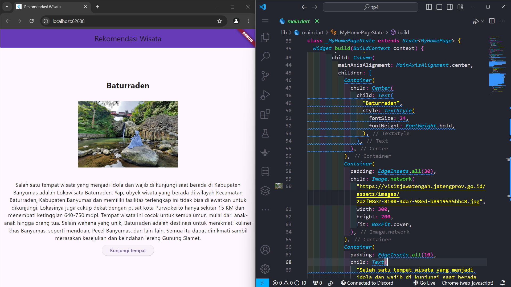

<div style="text-align: center;">

#### TUGAS PENDAHULUAN  
#### PEMROGRAMAN PERANGKAT BERGERAK  
#### MODUL IV  
#### ANTARMUKA PENGGUNA  


**Disusun Oleh:**  
**Gideon Toranawa Ladiyo / 2211104022**  
**SE-06-01**  

**Asisten Praktikum:**  
Muhammad Faza Zulian Gesit Al Barru  
Aisyah Hasna Aulia  

**Dosen Pengampu:**  
Yudha Islami Sulistya, S.Kom., M.Cs.  


**PROGRAM STUDI S1 SOFTWARE ENGINEERING**  
**FAKULTAS INFORMATIKA**  
**TELKOM UNIVERSITY PURWOKERTO**  
**2024**

</div>

---

### Membuat Tampilan Antarmuka
#### Soal:
- Membuat Antarmuka Pengguna dengan tampilan seperti berikut:
    

#### Kode program:
```
import 'package:flutter/material.dart';

void main() {
  runApp(const MyApp());
}

class MyApp extends StatelessWidget {
  const MyApp({super.key});

  // This widget is the root of your application.
  @override
  Widget build(BuildContext context) {
    return MaterialApp(
      title: 'Rekomendasi Wisata',
      theme: ThemeData(
        colorScheme: ColorScheme.fromSeed(seedColor: Colors.deepPurple),
        useMaterial3: true,
      ),
      home: const MyHomePage(title: 'Rekomendasi Wisata'),
    );
  }
}

class MyHomePage extends StatefulWidget {
  const MyHomePage({super.key, required this.title});

  final String title;

  @override
  State<MyHomePage> createState() => _MyHomePageState();
}

class _MyHomePageState extends State<MyHomePage> {
  @override
  Widget build(BuildContext context) {
    return Scaffold(
      appBar: AppBar(
        backgroundColor: Colors.deepPurple,
        title: Text('Rekomendasi Wisata'),
        centerTitle: true,
      ),
      body: Center(
        child: Column(
          mainAxisAlignment: MainAxisAlignment.center,
          children: [
            Container(
              child: Center(
                child: Text(
                  "Baturraden",
                  style: TextStyle(
                    fontSize: 24,
                    fontWeight: FontWeight.bold,
                  ),
                ),
              ),
            ),
            Container(
              padding: EdgeInsets.all(30),
              child: Image.network(
                "https://visitjawatengah.jatengprov.go.id/assets/images/2a2f08e2-8100-4da7-98ed-b8919535bbc8.jpg",
                width: 300,
                height: 200,
                fit: BoxFit.cover,
              ),
            ),
            Container(
              padding: EdgeInsets.all(10),
              child: Text(
                "Salah satu tempat wisata yang menjadi idola dan wajib di kunjungi saat berada di Kabupaten Banyumas adalah Lokawisata Baturraden. Yap, obyek wisata yang berada di wilayah Kecamatan Baturraden, Kabupaten Banyumas dan memiliki fasilitas terlengkap ini tidak bisa dilewatkan untuk dikunjungi. Lokasinya juga cukup dekat dengan pusat kota Purwokerto hanya sekitar 15 KM dan menempati ketinggian 640-750 mdpl. Tempat wisata ini cocok untuk semua umur, mulai dari anak-anak hingga orang tua. Selain wahana yang unik, Baturraden adalah destinasi untuk menikmati kuliner khas Banyumas, seperti mendoan, Pecel Banyumas, dan lain-lain. Semua itu dapat dinikmati sambil merasakan kesejukan dan keindahan lereng Gunung Slamet.",
                textAlign: TextAlign.center,
                style: TextStyle(fontSize: 16),
                ),
            ),
            Container(
              child: ElevatedButton(onPressed: () {
                ScaffoldMessenger.of(context).showSnackBar(
                  const SnackBar(content: Text("Menuju ke baturraden"))
                );
              }, 
              child: const Text("Kunjungi tempat")),
            ),
          ],
        ),
      )
    );
  }
}

```

#### Output:
