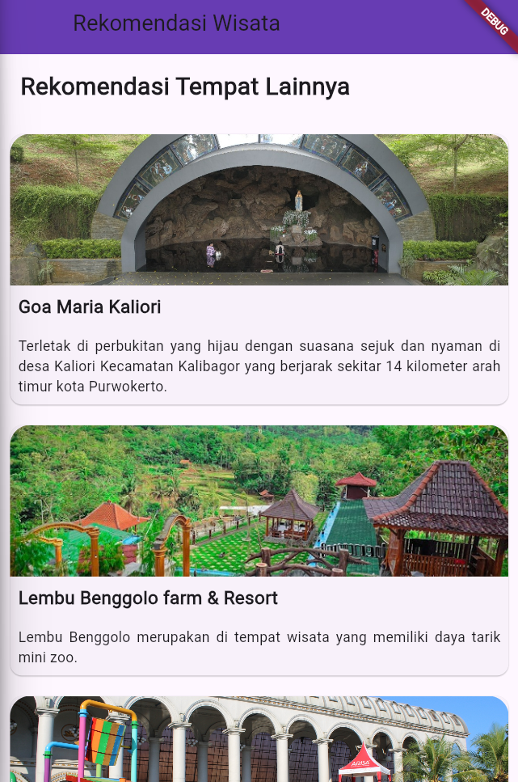

# Pertemuan 5

---

## Guided

### ListView.Builder

Code:
```
  final List<String> entries = <String>['A', 'B', 'C'];
  final List<int> colorCodes = <int>[600, 500, 100];
  @override
  Widget build(BuildContext context) {
    return Scaffold(
      appBar: AppBar(
        backgroundColor: Theme.of(context).colorScheme.inversePrimary,
        title: Text(widget.title),
      ),
      body: Center(
        child: ListView.builder(
          padding: const EdgeInsets.all(8),
          itemCount: entries.length,
          itemBuilder: (BuildContext context, int index) {
            return Container(
              height: 50,
              color: Colors.amber[colorCodes[index]],
              child: Center(
                child: Text('Entry ${entries[index]}'),
              ),
            );
          },
        ),
      ),
    );
  }
```

Output:


### ListView.Separated

Code:
```
  final List<String> entries = <String>['A', 'B', 'C'];
  final List<int> colorCodes = <int>[600, 500, 100];
  @override
  Widget build(BuildContext context) {
    return Scaffold(
      appBar: AppBar(
        backgroundColor: Theme.of(context).colorScheme.inversePrimary,
        title: Text(widget.title),
      ),
      body: Center(
        child: ListView.separated(
          padding: const EdgeInsets.all(8),
          itemCount: entries.length,
          itemBuilder: (BuildContext context, int index) {
            return Container(
              height: 50,
              color: Colors.amber[colorCodes[index]],
              child: Center(
                child: Text('Entry ${entries[index]}'),
              ),
            );
          },
          separatorBuilder: (BuildContext context, int index) => const Divider(),
        ),
      ),
    );
  }
```

output:


### Flexible & Expanded

Code:
```
        child: Column(
          // mainAxisAlignment: MainAxisAlignment.center,
          children: [
            // flexible
            Row(
              children: <Widget>[
                Container(
                  width: 50,
                  height: 100,
                  color: Colors.red,
                ),
                Flexible(
                  child: Container(
                    height: 100,
                    color: Colors.green,
                    child: Text(
                      "Flexible takes up the remaining space but can shrink if needed.",
                    ),
                  ),
                ),
                const Icon(Icons.sentiment_very_satisfied)
              ],
            ),
            SizedBox(
              height: 20,
            ),

            // expanded
            Row(
              children: <Widget>[
                Container(
                  width: 50,
                  height: 100,
                  color: Colors.red,
                ),
                Expanded(
                  child: Container(
                  height: 100,
                  color: Colors.green,
                  child: const Text(
                    "Expanded item",
                  ),
                )),
                const Icon(Icons.sentiment_very_satisfied)
              ],
            )
          ],
        ),
```

Output:


### CustomScrollView

Code:
```
      body: CustomScrollView(
        slivers: <Widget>[
          // silverAppBar
          const SliverAppBar(
            backgroundColor: Color.fromRGBO(162, 210, 223, 100),
            pinned: true,
            expandedHeight: 50,
            flexibleSpace: FlexibleSpaceBar(
              title: Text("demo"),
            ),
          ),
          // silver grid
          SliverGrid(
            delegate: SliverChildBuilderDelegate(
              (BuildContext context, int index) {
                return Container(
                  alignment: Alignment.center,
                  color: Colors.teal[100 * (index % 9)],
                  child: Text('Grid Item $index'),
                );
              },
              childCount: 20,
            ),
            gridDelegate: const SliverGridDelegateWithMaxCrossAxisExtent(
              maxCrossAxisExtent: 200,
              mainAxisSpacing: 10,
              crossAxisSpacing: 10,
              childAspectRatio: 4,
            ),
          ),
          SliverFixedExtentList(
            itemExtent: 30.0,
            delegate: SliverChildBuilderDelegate(
              (BuildContext context, int index) {
                return Container(
                  alignment: Alignment.center,
                  color: Colors.lightBlue[100 * (index % 10)],
                  child: Text('List Item $index'),
                );
              },
              childCount: 20
            ),
          )
        ],
      ),
```


Output:


---
## Unguided

### Menerapkan CustomScrollView dan SliverAppBar

Code:
```
      body: CustomScrollView(
        slivers: [
          SliverAppBar(
            backgroundColor: Colors.deepPurple,
            expandedHeight: 100.0,
            floating: true,
            pinned: true,
            flexibleSpace: FlexibleSpaceBar(
              title: Text(widget.title),
            ),
          ),
```
Penjelasan:
Dari Tugas TP Sebelumnya, kita hanya mengganti body menjadi `CustomScrollView` agar layar bisa discroll. Kemudian kita menambahkan `slivers: []` untuk menampung widget dari `Sliver`. Di dalamnya kita menambahkan widget `SliverAppBar` untuk membuat Appbar.

Output:


### Menerapkan SliverList

Code:
```
    final List<Map<String, String>> places = [
    {
      'name': 'Goa Maria Kaliori',
      'description':
          'Terletak di perbukitan yang hijau dengan suasana sejuk dan nyaman di desa Kaliori Kecamatan Kalibagor yang berjarak sekitar 14 kilometer arah timur kota Purwokerto.',
      'image': 'assets/goa-maria-kaliori.jpg'
    },
    {
      'name': 'Lembu Benggolo farm & Resort',
      'description':
          'Lembu Benggolo merupakan di tempat wisata  yang memiliki daya tarik mini zoo.',
      'image': 'assets/lembu-benggolo-farm-resort.jpg'
    },
    {
      'name': 'Depo Bay',
      'description':
          'Wisata renang yang terbuka untuk umum yang berada di Depo Pelita Sokaraja.',
      'image': 'assets/depo-bay.jpg'
    },
    {
      'name': 'Taman Botani',
      'description':
          'Taman Botani menyajikan bermacam jenis tanaman hias bunga anggrek yang menjadi sarana edukasi mengenal tanaman hias dengan berbagai keunikannya.',
      'image': 'assets/taman-botani.png'
    },
    {
      'name': 'Sukan River Tubing',
      'description':
          'Sukan River Tubing adalah sebuah olahraga air dengan memanfaatkan aliran sungai irigasi yang bernama Kali Sukan.',
      'image': 'assets/sukan-river-tubing.jpg'
    },
  ];
          SliverList(
            delegate: SliverChildBuilderDelegate(
              (context, index) {
                return Card(
                  margin: const EdgeInsets.all(10),
                  child: Column(
                    crossAxisAlignment: CrossAxisAlignment.start,
                    children: [
                      ClipRRect(
                        borderRadius: const BorderRadius.only(
                            topLeft: Radius.circular(20),
                            topRight: Radius.circular(20)),
                        child: Image.asset(
                          places[index]['image']!,
                          width: double.infinity,
                          height: 150,
                          fit: BoxFit.cover,
                        ),
                      ),
                      Padding(
                        padding: const EdgeInsets.all(8.0),
                        child: Text(
                          places[index]['name']!,
                          style: const TextStyle(
                            fontSize: 18,
                            fontWeight: FontWeight.bold,
                          ),
                        ),
                      ),
                      Padding(
                        padding: const EdgeInsets.all(8.0),
                        child: Text(
                          places[index]['description']!,
                          textAlign: TextAlign.justify,
                          style: const TextStyle(fontSize: 14),
                        ),
                      ),
                    ],
                  ),
                );
              },
              childCount: places.length,
            ),
          ),
```

Penjelasan:
Saat ini kita mengubah widget `ListView` menjadi widget `SliverListView` dengan return card berdasarkan jumlah tempat wisata yang ada di dalam data `places`.

Output:


