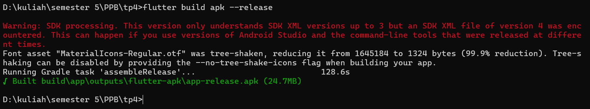
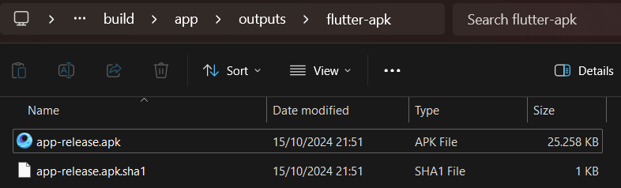

<div style="text-align: center;">

#### TUGAS PENDAHULUAN  
#### PEMROGRAMAN PERANGKAT BERGERAK  
#### MODUL IV  
#### ANTARMUKA PENGGUNA  


**Disusun Oleh:**  
**Nama Lengkap / NIM**  
**Kelas**  

**Asisten Praktikum:**  
Muhammad Faza Zulian Gesit Al Barru  
Aisyah Hasna Aulia  

**Dosen Pengampu:**  
Yudha Islami Sulistya, S.Kom., M.Cs.  


**PROGRAM STUDI S1 SOFTWARE ENGINEERING**  
**FAKULTAS INFORMATIKA**  
**TELKOM UNIVERSITY PURWOKERTO**  
**2024**

</div>

---

<div style="text-align: center;"> 

#### Tugas Pendahuluan

</div>

Output:






Source Code:

```
flutter build apk –release
```

Deskripsi:
Di sini kita membuat project yang dibuat menjadi file APK sehingga bisa diinstall di android. Pertama buka terminal pada project lalu masukkan `Source Code` lalu enter, setelah itu tunggu hingga proses selesai. Jika proses telah selesai, file apk akan otomatis tersimpan di folder `build/app/outputs/flutter-apk/app-release.apk`. Kirim file tersebut ke android lalu lakukan penginstalan. setelah diinstall maka project yang dibuat dapat dibuka di android.