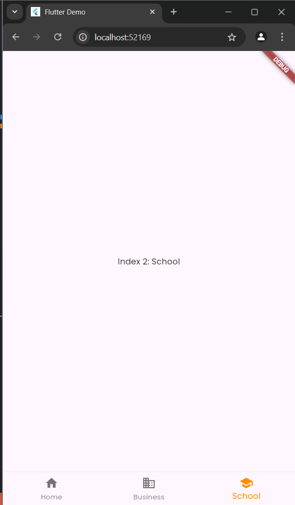

# Pertemuan 6
---
## Interaksi Pengguna
### Guided
#### Packages:
Letakan package yang akan digunakan di file `pupspec.yaml` seperti berikut:
code:
```
dependencies:
  flutter:
    sdk: flutter
  google_fonts: ^6.2.1
```

#### Form with Button
Code:
```
import 'package:flutter/material.dart';

class MyButton extends StatefulWidget {
  const MyButton({super.key});

  @override
  State<MyButton> createState() => _MyButtonState();
}

class _MyButtonState extends State<MyButton> {
  @override
  Widget build(BuildContext context) {
    return Padding(
      padding: EdgeInsets.all(16),
      child: Scaffold(
        body: Column(
          children: [
            Container(
              decoration: BoxDecoration(
                border: Border.all(color: Colors.blue),
                borderRadius: BorderRadius.circular(12),
              ),
              child: const TextField(
                decoration: InputDecoration(
                  prefixIcon: Icon(Icons.person),
                  border: InputBorder.none,
                  hintText: "Masukkan nama",
                  contentPadding: EdgeInsets.all(16),
                ),
              ),
            ),
            const SizedBox(height: 16),
            Container(
              decoration: BoxDecoration(
                border: Border.all(color: Colors.blue),
                borderRadius: BorderRadius.circular(12),
              ),
              child: const TextField(
                decoration: InputDecoration(
                  prefixIcon: Icon(Icons.lock),
                  border: InputBorder.none,
                  hintText: "Masukkan password",
                  contentPadding: EdgeInsets.all(16),
                ),
              ),
            ),
            SizedBox(height: 20,),
            ElevatedButton(
              onPressed: (){}, 
              child: Text(
                "Submit"
              ),
              style: ElevatedButton.styleFrom(
                minimumSize: const Size(100, 50),
                foregroundColor: Colors.amber, // Warna latar belakang
                textStyle: TextStyle(
                  color: Colors.white,
                ),
                padding:
                    const EdgeInsets.symmetric(horizontal: 24, vertical: 12),
                shape: RoundedRectangleBorder(
                  borderRadius: BorderRadius.circular(12), // Radius sudut
                ),
              ),
            ),
          ],
        ),
      ),
    );
  }
}
```

Output:


#### Menu
Tab Controller
Code:
```
import 'package:flutter/material.dart';

class Tabview extends StatelessWidget {
  const Tabview({super.key});

  @override
  Widget build(BuildContext context) {
    return DefaultTabController(
      length: 3,
      child: Scaffold(
        appBar: AppBar(
          title: Text("Contoh Tab View"),
          backgroundColor: Colors.amber,
          bottom: TabBar(
            tabs: [
              Tab(
                icon: Icon(Icons.directions_car),
                text: "Tab 1",
              ),
              Tab(
                icon: Icon(Icons.directions_transit),
                text: "Tab 2",
              ),
              Tab(
                icon: Icon(Icons.directions_bike),
                text: "Tab 3",
              ),
            ],
          ),
        ),
        body: TabBarView(
          children: [
            Center(
              child: Text("Konten Tab 1"),
            ),
            Center(
              child: Text("Konten Tab 2"),
            ),
            Center(
              child: Text("Konten Tab 3"),
            ),
          ],
        ),
      )
    );
  }
}
```

Output:


#### Bottom Navbar
Code:
```
import 'package:flutter/material.dart';
import 'tabView.dart';
import 'button.dart';

class MyBottom extends StatefulWidget {
  const MyBottom({super.key});

  @override
  State<MyBottom> createState() => _MyButtonState();
}

class _MyButtonState extends State<MyBottom> {
  int selected_idx = 0;

  static const TextStyle optionStyle =
      TextStyle(fontSize: 30, fontWeight: FontWeight.bold);

  static const List<Widget> _widgetOption = <Widget>[
    Tabview(),
    MyButton(),
    Text("Index 2: School")
  ];

  void onItemTapped(int index) {
    setState(() {
      selected_idx = index;
    });
  }

  @override
  Widget build(BuildContext context) {
    return Scaffold(
      body: Center(
        child: _widgetOption.elementAt(selected_idx),
      ),
      bottomNavigationBar: BottomNavigationBar(
        items: const <BottomNavigationBarItem>[
          BottomNavigationBarItem(
            icon: Icon(Icons.home), 
            label: "Home"
          ),
          BottomNavigationBarItem(
            icon: Icon(Icons.business), 
            label: "Business"
          ),
          BottomNavigationBarItem(
            icon: Icon(Icons.school), 
            label: "School"
          )
        ],
        currentIndex: selected_idx,
        selectedItemColor: Colors.amber[800],
        onTap: onItemTapped,
      ),
    );
  }
}

```
Output:




#### Dropdown Button
Code:
```
String? selectedValue;
DropdownButton(
              value: selectedValue,
              hint: Text('Pilih Opsi'),
              onChanged: (String? newValue) {
                setState(() {
                  selectedValue = newValue;
                });
              },
              items: <String>['Opsi 1', 'Opsi 2', 'Opsi 3']
                  .map<DropdownMenuItem<String>>((String value) {
                return DropdownMenuItem<String>(
                  value: value,
                  child: Text(value),
                );
              }).toList(),
            )
```


---
### Unguided

Code `main.dart`:
```
import 'package:flutter/material.dart';
import 'package:tp/formLogin.dart';

void main() {
  runApp(const MyApp());
}

class MyApp extends StatelessWidget {
  const MyApp({super.key});

  @override
  Widget build(BuildContext context) {
    return MaterialApp(
      title: 'Flutter Demo',
      theme: ThemeData(
        colorScheme: ColorScheme.fromSeed(seedColor: Colors.deepPurple),
        useMaterial3: true,
      ),
      home: const MyHomePage(),
    );
  }
}

class MyHomePage extends StatefulWidget {
  const MyHomePage({super.key});

  @override
  State<MyHomePage> createState() => _MyHomePageState();
}

class _MyHomePageState extends State<MyHomePage> {
  int selectedIndex = 0;

  static const TextStyle optionStyle = TextStyle(
    fontSize: 20,
  );

  static List<Widget> widgetOptions = <Widget>[
    FormLoginPage(),
    const Text(
      "Ini halaman search",
      style: optionStyle,
    ),
    const Text(
      "Ini halaman profil",
      style: optionStyle,
    )
  ];

  static const List<String> titles = ["Beranda", "Search", "Profile"];

  void onTapped(int index) {
    setState(() {
      selectedIndex = index;
    });
  }

  @override
  Widget build(BuildContext context) {
    return Scaffold(
      appBar: AppBar(
        backgroundColor: Colors.amber[800],
        title: Text(
            titles[selectedIndex]),
      ),
      body: Center(
        child: widgetOptions.elementAt(selectedIndex),
      ),
      bottomNavigationBar: BottomNavigationBar(
        items: const <BottomNavigationBarItem>[
          BottomNavigationBarItem(icon: Icon(Icons.home), label: "Beranda"),
          BottomNavigationBarItem(icon: Icon(Icons.search), label: "Search"),
          BottomNavigationBarItem(icon: Icon(Icons.person), label: "Profile")
        ],
        currentIndex: selectedIndex,
        selectedItemColor: Colors.amber[800],
        onTap: onTapped,
      ),
    );
  }
}
```

Code `formLogin.dart`:
```
import 'package:flutter/material.dart';

class FormLoginPage extends StatelessWidget {
  const FormLoginPage({super.key});
  @override
  Widget build(BuildContext context) {
    return Padding(
      padding: const EdgeInsets.all(12),
      child: Column(
        crossAxisAlignment: CrossAxisAlignment.center,
        children: [
          Container(
            decoration: BoxDecoration(
              border: Border.all(
                color: Colors.blue,
              ),
              borderRadius: BorderRadius.circular(12),
            ),
            child: TextField(
              decoration: InputDecoration(
                border: InputBorder.none,
                hintText: "Masukkan nama",
                contentPadding: EdgeInsets.all(16),
              ),
            ),
          ),
          SizedBox(height: 16,),
          Container(
            decoration: BoxDecoration(
              border: Border.all(
                color: Colors.blue,
              ),
              borderRadius: BorderRadius.circular(12),
            ),
            child: TextField(
              decoration: InputDecoration(
                border: InputBorder.none,
                hintText: "Masukkan email",
                contentPadding: EdgeInsets.all(16),
              ),
            ),
          ),
          SizedBox(height: 16,),
          ElevatedButton(
            onPressed: (){},
            child: Text("Submit"),
            style: ElevatedButton.styleFrom(
              backgroundColor: Colors.amber,
              minimumSize: const Size(100, 60),
              shape: RoundedRectangleBorder(
                borderRadius: BorderRadius.circular(15)
              )
            ),
          )
        ],
      ),
    );
  }
}
```

Output:


Penjelasan:
Pertama di file `main.dart` kita deklarasi variabel List untuk mengganti halaman ketika bottom nav diganti. Kita memodifikasi bagian ini:
```
  static List<Widget> widgetOptions = <Widget>[
    FormLoginPage(),
    const Text(
      "Ini halaman search",
      style: optionStyle,
    ),
    const Text(
      "Ini halaman profil",
      style: optionStyle,
    )
  ];
```
dengan memanggil `FormLoginPage()` yang ada di file `formLogin.dart` untuk menampilkan form login yang telah dibuat. Untuk membuat form login, kita hanya perlu membuat container yang berisi TextField agar user bisa menginput text. Buat widget elevated button untuk membuat button nya