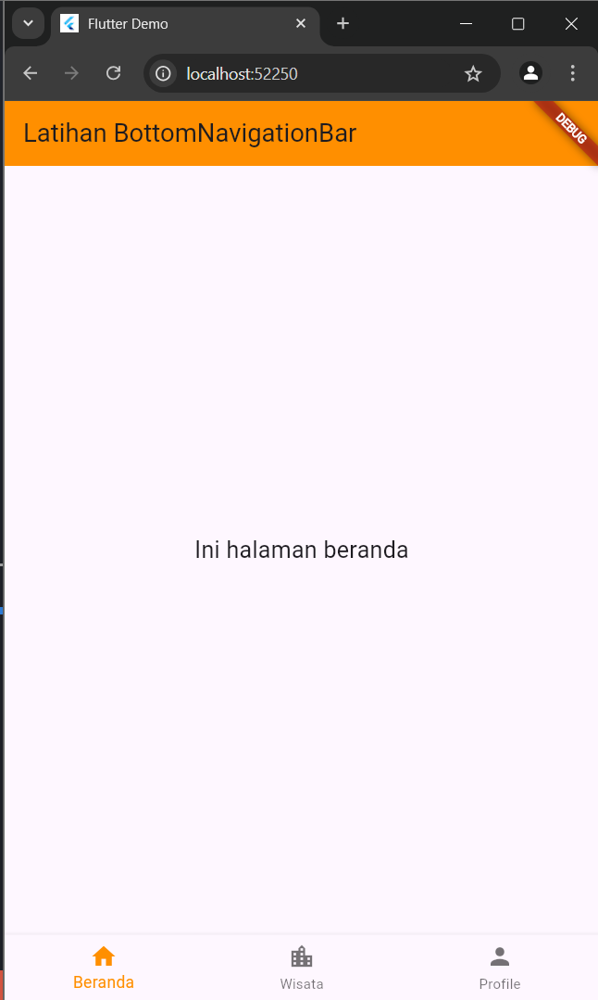
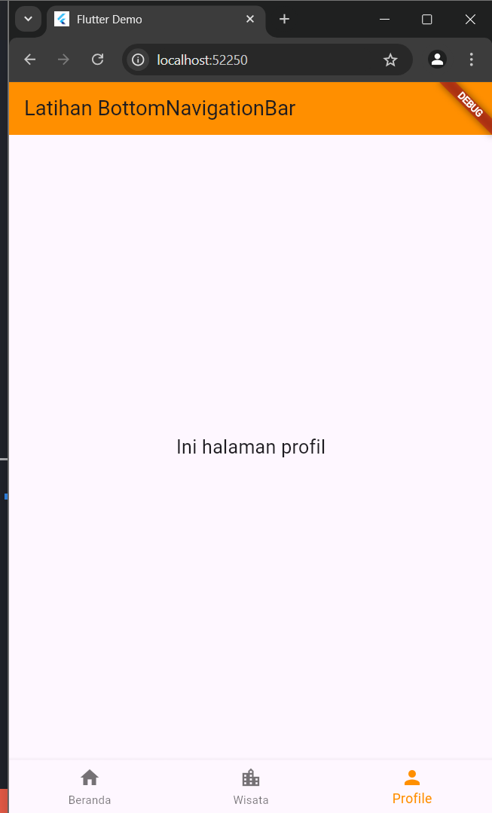

<div style="text-align: center;">

#### TUGAS PENDAHULUAN  
#### PEMROGRAMAN PERANGKAT BERGERAK  
#### MODUL VI
#### Interaksi Pengguna


**Disusun Oleh:**  
**Gideon Toranawa Ladiyo / 2211104022**  
**SE0601** 

**Asisten Praktikum:**  
Muhammad Faza Zulian Gesit Al Barru  
Aisyah Hasna Aulia  

**Dosen Pengampu:**  
Yudha Islami Sulistya, S.Kom., M.Cs.  


**PROGRAM STUDI S1 SOFTWARE ENGINEERING**  
**FAKULTAS INFORMATIKA**  
**TELKOM UNIVERSITY PURWOKERTO**  
**2024**

</div>

---

### Implementasi Bottom Navigation Bar

Output:








Code:
```
import 'package:flutter/material.dart';

void main() {
  runApp(const MyApp());
}

class MyApp extends StatelessWidget {
  const MyApp({super.key});

  // This widget is the root of your application.
  @override
  Widget build(BuildContext context) {
    return MaterialApp(
      title: 'Flutter Demo',
      theme: ThemeData(
        colorScheme: ColorScheme.fromSeed(seedColor: Colors.deepPurple),
        useMaterial3: true,
      ),
      home: const MyHomePage(),
    );
  }
}

class MyHomePage extends StatefulWidget {
  const MyHomePage({super.key});

  @override
  State<MyHomePage> createState() => _MyHomePageState();
}

class _MyHomePageState extends State<MyHomePage> {

  int selectedIndex = 0;

  static const TextStyle optionStyle = TextStyle(
    fontSize: 20,
  );

  static const List<Widget> widgetOptions = <Widget>[
    Text(
      "Ini halaman beranda",
      style: optionStyle,
    ),
    Text(
      "Ini halaman wisata",
      style: optionStyle,
    ),
    Text(
      "Ini halaman profil",
      style: optionStyle,
    )
  ];

  void onTapped(int index){
    setState(() {
      selectedIndex = index;
    });
  }

  @override
  Widget build(BuildContext context) {
    return Scaffold(
      appBar: AppBar(
        backgroundColor: Colors.amber[800],
        title: Text("Latihan BottomNavigationBar"),
      ),
      body: Center(
        child: widgetOptions.elementAt(selectedIndex),
      ),
      bottomNavigationBar: BottomNavigationBar(
        items: const <BottomNavigationBarItem>[
          BottomNavigationBarItem(icon: Icon(Icons.home), label: "Beranda"),
          BottomNavigationBarItem(icon: Icon(Icons.location_city), label: "Wisata"),
          BottomNavigationBarItem(icon: Icon(Icons.person), label: "Profile")
        ],
        currentIndex: selectedIndex,
        selectedItemColor: Colors.amber[800],
        onTap: onTapped,
      ),
    );
  }
}

```


Penjelasan:
Kita membuat bottom navigation bar dalam dart dengan cara:
1. Buat `widgetOption` dengan tipe `list` untuk menampung apa saja tampilan yang akan keluar saat menekan tombol di bottom navbar.
2. Buat fungsi `onTapped()` untuk mengubah index sehingga menampilkan halaman yang berbeda dari `widgetOption`.
3. Di dalam body, berikan child untuk memanggil `widgetOption` berdasarkan index yang dipilih.
4. Buat widget `bottomNavigationBar` di luar body untuk membuat item dengan jumlah item seusai dengan soal yaitu terdapat 3 item.
5. Panggil fungsi onTapped pada onTap dari widget `bottomNavigationBar` untuk mengganti index