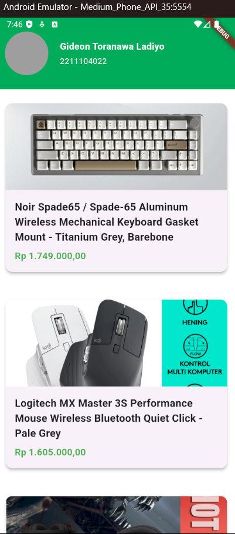
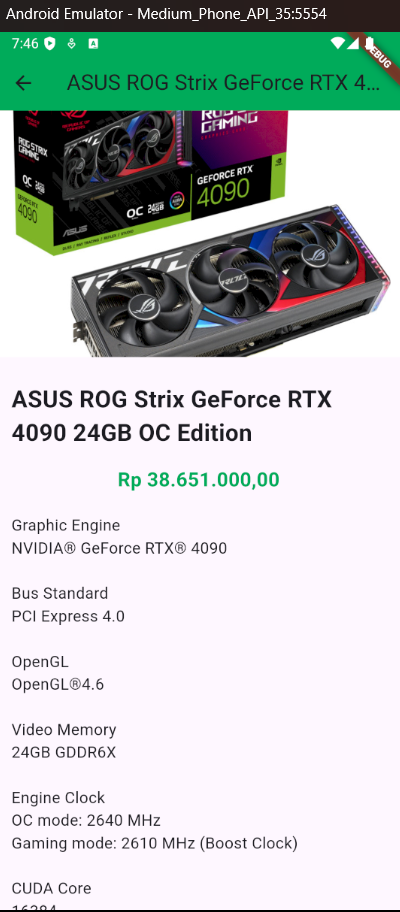

# Laporan Proktikum Pemrograman Perangkat Bergerak
## Navigasi dan Notifikasi
---
### Unguided
Membuat project untuk menampilkan beberapa produk dan halaman e-commerce dengan menerapkan class model serta navigasi halaman

Langkah-langkah:
#### 1. Inisiasi class model untuk mendefinisikan data
Buat folder dengan nama model di lib kemudian buat file dengan nama `product.dart`. Isi file tersebut dengan atribut-atribut dari produk seperti berikut:
```
class Product {
  final int id;
  final String imageURL;
  final String nama;
  final double harga;
  final String deskripsi;

  const Product({
    required this.id,
    required this.imageURL,
    required this.nama,
    required this.harga,
    required this.deskripsi
  });

  factory Product.fromJSON(Map<String, dynamic> json) {
    return Product(
        id: json['idProduk'],
        nama: json['title'],
        harga: json['harga'].toDoble(),
        imageURL: json['imageURL'],
        deskripsi: json['deskripsi']);
  }

  Map<String, dynamic> toJson() {
    return {
      'id': id,
      'nama': nama,
      'harga': harga,
      'imageURL': imageURL,
      'deskripsi': deskripsi
    };
  }
}
```
#### 2. Buat daftar produk
Buat file baru dengan nama `listProduct.dart` di folder model yang akan digunakan untuk mengisi daftar dari produk.
```
import 'package:unguided7/models/product.dart';

final List<Product> products = [
  const Product(
      id: 1,
      nama:
          "Noir Spade65 / Spade-65 Aluminum Wireless Mechanical Keyboard Gasket Mount - Titanium Grey, Barebone",
      harga: 1749000.00,
      imageURL:
          "https://images.tokopedia.net/img/cache/900/VqbcmM/2024/11/1/5ffb781b-ef39-45d8-ad72-526da6d417a1.png",
      deskripsi: ''' NEW VERSION VIA/QMK COMPATIBILITY

BAREBONE : TANPA SWITCH DAN KEYACPS
BAREBONE+KEYCAPS : TANPA SWITCH

Tersedia Plate dan Deskmat Terpisah :
PLATE :
DESKMAT :

Features:
- Aluminum 6063 Shell
- Classic art deco themed design
- Spade65 carrying case
- Multi layout configuration (ANSI & ISO with split spacebar support)
- 3 modes connection (Wired, Wireless 2.4 GHz & Bluetooth)
- 3 layer foam dampener
- Gasket mount (Silicone)
- Flex-cut PCB
- Flex-cut plate (PC) + optional FR4 plate sold separately
- Multimedia knob
- Pre-lubed stabilizers
- South facing switch mounting
- Hot-swappable 3 & 5 pin
- PBT dye-sub keycaps + extra ISO layout & split spacebar
- Coiled cable + straight cable

Connection:
- Type-C
- Wireless 2.4 GHz
- Bluetooth up to 3 devices

Specifications:
- Model: Noir Spade65
- Material: Aluminum 6063
- Connection: Wired, Bluetooth 5.0, Wireless 2.4GHz
- Plate: PC
- IXPE Switch Pad
- Poron Plate Foam
- Poron Case Foam
- Pre-lubed Stabilizer
- Extra ISO layout & split spacebar keycaps
- Keys: 66 Keys
- Weight: 1355 ±10 gram
- Cable: 1 Coiled + 1 Straight
- Battery Capacity: 4000 mAh
- Keycaps Material: PBT Dyesub
- Dimension: 326 x 114 x 31mm
- Compatible with Windows and Mac OS

Isi kemasan:
- 1x Noir Spade65
- 1x Carrying case
- 1x Type-C Braided Coiled Cable
- 1x Type-C Braided Straight Cable
- 1x 2.4GHz USB Dongle
- 1x Thank you card
- 1x Keycaps & switch puller
- 3x Extra switch
- 1x ISO Enter keycap
- 1x R2 1u “|\” keycap
- 1x 2.25u spacebar keycap
- 1x 2.75u spacebar keycap
- 1x R1 1.25u blank keycap
- 1x Hex 1.5 allen key


ONE YEAR LIMITED WARRANTY
SERTAKAN UNBOXING VIDEO UNTUK CLAIM PENGGANTIAN UNIT JIKA TERJADI KERUSAKAN PADA UNIT YANG DITERIMA.
JIKA TERJADI KERUSAKAN APAPUN SELAMA 7 HARI SETELAH BARANG TIBA, AKAN DI GANTI UNIT YANG BARU. '''),
  const Product(
      id: 2,
      nama: "Logitech MX Master 3S Performance Mouse Wireless Bluetooth Quiet Click - Pale Grey",
      harga: 1605000.00,
      imageURL:
          "https://images.tokopedia.net/img/cache/900/VqbcmM/2024/10/3/38899959-8347-44ef-b985-095a2b925960.jpg",
      deskripsi: "Scrolling elektromagnetik MagSpeed menghadirkan kecepatan luar biasa, presisi, dan nyaris tidak bersuara dengan kemampuan scroll 1.000 baris per detik. Siluet ergonomisnya dibuat untuk menopang telapak tangan dan jemarimu. Logi Options+ memungkinkan mengatur Flow lintas-komputer dan menghadirkan lebih banyak kustomisasi dibandingkan sebelumnya."),
  const Product(
      id: 2,
      nama: "Fantech SONATA MH90 Headset Gaming Mobile Multiplatform FREE SPLITTER - Headset Only",
      harga: 449000.00,
      imageURL:
          "https://images.tokopedia.net/img/cache/900/VqbcmM/2021/10/8/5aef1f0a-5ff4-4a35-9af9-1cc953558ebf.jpg",
      deskripsi: '''Sering diremehkan dan dianggap tidak berguna ketika kamu sedang menggeluti bidang yang kamu cintai? Sudah saatnya menunjukkan bahwa bidang yang kamu cintai juga bisa bermanfaat dan menghasilkan! Hari pembuktian telah tiba! #TheMaestro '''),
  const Product(
      id: 3,
      nama:
          "ASUS ROG Strix GeForce RTX 4090 24GB OC Edition",
      harga: 38651000.00,
      imageURL:
          "https://images.tokopedia.net/img/cache/900/VqbcmM/2022/10/12/96bcfdea-f74a-4ead-afee-1375501e1af9.png",
      deskripsi:
          '''Graphic Engine
NVIDIA® GeForce RTX® 4090

Bus Standard
PCI Express 4.0

OpenGL
OpenGL®4.6

Video Memory
24GB GDDR6X

Engine Clock
OC mode: 2640 MHz
Gaming mode: 2610 MHz (Boost Clock)

CUDA Core
16384

Memory Speed
21 Gbps

Memory Interface
384-bit

Resolution
Digital Max Resolution 7680 x 4320

Interface
Yes x 2 (Native HDMI 2.1a)
Yes x 3 (Native DisplayPort 1.4a)
HDCP Support Yes (2.3)

Maximum Display Support
4

Software
ASUS GPU Tweak III & GeForce Game Ready Driver & Studio Driver: please download all software from the support site.

Dimensions
357.6 x 149.3 x 70.1mm

Recommended PSU
1000W

Power Connectors
1 x 16-pin

Slot
3.5 Slot

AURA SYNC
ARGB'''),
];
```
#### 3. Buat Widget Card
Kemudian kita akan membuat widget card yang nantinya akan menampilkan produk dalam bentuk card. Buat file dengan nama `product_card.dart` untuk membuatnya.
```
import 'package:flutter/material.dart';
import 'package:unguided7/models/product.dart';
import 'package:intl/intl.dart';

class ProductCard extends StatelessWidget {
  final Product product;

  const ProductCard({super.key, required this.product});

  @override
  Widget build(BuildContext context) {
    String formattedPrice = NumberFormat.currency(
      locale: 'id_ID',
      symbol: 'Rp ',
      decimalDigits: 2,
    ).format(product.harga);
    return Card(
      elevation: 4,
      shape: RoundedRectangleBorder(
        borderRadius: BorderRadius.circular(12)
      ),
      child: Column(
        crossAxisAlignment: CrossAxisAlignment.start,
        children: [
          ClipRRect(
            borderRadius: const BorderRadius.vertical(top: Radius.circular(12)),
            child: Image.network(
              product.imageURL,
              height: 150,
              width: double.infinity,
              fit: BoxFit.cover,
            ),
          ),
          Padding(
            padding: const EdgeInsets.all(16),
            child: Column(
              crossAxisAlignment: CrossAxisAlignment.start,
              children: [
                Text(
                  product.nama,
                  style: const TextStyle(
                    fontSize: 18,
                    fontWeight: FontWeight.bold,
                  ),
                ),
                const SizedBox(height: 8,),
                Text(
                  formattedPrice,
                  style: const TextStyle(
                    fontSize: 16,
                    color: Colors.green,
                    fontWeight: FontWeight.bold
                  ),
                )
              ],
            ),
          )
        ],
      ),
    );
  }
}
```
#### 4. Definisikan color palette
Salah satu bagian terpenting dalam pembuatan aplikasi adalah memberikan warna. Untuk itu kita perlu mendefinisikan tiap warna agar lebih rapi dan mudah ketika ingin mengubah color palette. Buat folder colors di folder lib kemudian buat file dengan nama `appColors.dart`.
```
import 'dart:ui';

import 'package:flutter/material.dart';

class AppColors {
  static const primary = Color.fromRGBO(0, 171, 91, 1);
  static const white = Colors.white;
  static const black = Colors.black;
}
```
#### 5. Buat AppBar
Sebelum memulai untuk membuat di file main, kita perlu untuk membuat AppBar terlebih dahulu sehingga jumlah baris di file main tidak banyak. Pertama buat folder dengan nama widget kemudian buat file dengan nama `sliverAppBar.dart`.
```
import 'package:flutter/material.dart';
import 'package:unguided7/colors/appColors.dart';

class Sliverappbar extends StatelessWidget {
  const Sliverappbar({super.key});

  @override
  Widget build(BuildContext context) {
    return SliverAppBar(
      pinned: true,
      expandedHeight: 100, // Tetap ini jika Anda ingin ukuran saat expanded.
      collapsedHeight: 80, // Atur tinggi saat tidak di-expand
      backgroundColor: AppColors.primary,
      flexibleSpace: Container(
        padding: const EdgeInsets.all(13),
        child: Row(
          crossAxisAlignment: CrossAxisAlignment.center,
          children: [
            Container(
              height: 75,
              width: 75,
              decoration: const BoxDecoration(
                shape: BoxShape.circle,
                color: Colors.grey,
              ),
            ),
            const SizedBox(width: 20),
            const Expanded(
              child: Column(
                mainAxisAlignment: MainAxisAlignment.center,
                crossAxisAlignment: CrossAxisAlignment.start,
                children: const [
                  Text(
                    "Gideon Toranawa Ladiyo",
                    style: TextStyle(
                      fontSize: 16,
                      color: AppColors.white,
                      fontWeight: FontWeight.bold,
                    ),
                  ),
                  SizedBox(height: 4),
                  Text(
                    "2211104022",
                    style: TextStyle(
                      fontSize: 14,
                      color: AppColors.white,
                    ),
                  ),
                ],
              ),
            ),
          ],
        ),
      ),
    );
  }
}
```

File ini akan membuat return yang akan mengembalikan SliverAppBar ketika dipanggil.

#### 6. Buat file main
File main akan berisi home yang terdapat SliverAppBar dan daftar produk. File akan memanggil daftar produk dan tiap produk pada daftar akan dimasukkan ke dalam widget `ListView`. Tiap produk akan menampilkan produk yang berbeda dan akan menggunakan widget `GestureDetector` agar bisa melakukan navigasi ke halaman lain.
```
import 'package:flutter/material.dart';
import 'package:unguided7/colors/appColors.dart';
import 'package:unguided7/models/listProduct.dart';
import 'package:unguided7/models/product_card.dart';
import 'package:unguided7/pages/detail.dart';
import 'package:unguided7/widget/sliverAppBar.dart';

void main() {
  runApp(const MyApp());
}

class MyApp extends StatelessWidget {
  const MyApp({super.key});
  @override
  Widget build(BuildContext context) {
    return MaterialApp(
      title: 'Flutter Demo',
      theme: ThemeData(
        colorScheme: ColorScheme.fromSeed(seedColor: Colors.deepPurple),
        useMaterial3: true,
      ),
      home: const MyHomePage(title: 'Flutter Demo Home Page'),
    );
  }
}

class MyHomePage extends StatefulWidget {
  const MyHomePage({super.key, required this.title});

  final String title;

  @override
  State<MyHomePage> createState() => _MyHomePageState();
}
class _MyHomePageState extends State<MyHomePage> {
  @override
  Widget build(BuildContext context) {
    return Scaffold(
      backgroundColor: AppColors.white,
      body: CustomScrollView(
        slivers: <Widget>[
          const Sliverappbar(),
          SliverList(
            delegate: SliverChildBuilderDelegate(
              (BuildContext content, int index) {
                final product = products[index];
                return GestureDetector(
                  onTap: (){
                    Navigator.push(
                      context, 
                      MaterialPageRoute(
                        builder: (_) => DetailPage(product: product)
                      )
                    );
                  },
                  child: Padding(
                    padding: const EdgeInsets.symmetric(horizontal: 10, vertical: 20),
                    child: ProductCard(product: product),
                  ),
                );
              },
              childCount: products.length,
            ),
          )
        ],
      ),
    );
  }
}
```
#### 7. Detail page
Halaman ini akan menampilkan data product yang telah dijadikan objek yang akan dikirim ke halaman selanjutnya.
```
import 'package:flutter/material.dart';
import 'package:unguided7/colors/appColors.dart';
import 'package:unguided7/models/product.dart';
import 'package:intl/intl.dart';

class DetailPage extends StatelessWidget {
  const DetailPage({super.key, required this.product});

  final Product product;

  @override
  Widget build(BuildContext context) {
    String formattedPrice = NumberFormat.currency(
      locale: 'id_ID', 
      symbol: 'Rp ',
      decimalDigits: 2,
    ).format(product.harga);
    return Scaffold(
      appBar: AppBar(
        title: Text(product.nama),
        backgroundColor: AppColors.primary,
      ),
      body: SingleChildScrollView(
        child: Column(
          children: [
            Container(
              height: 250,
              decoration: BoxDecoration(
                image: DecorationImage(
                  image: NetworkImage(product.imageURL),
                  fit: BoxFit.cover,
                ),
              ),
            ),
            const SizedBox(height: 10),
            Padding(
              padding: const EdgeInsets.all(16.0),
              child: Text(
                product.nama,
                style: const TextStyle(
                  fontSize: 24,
                  fontWeight: FontWeight.bold,
                ),
              ),
            ),
            Padding(
              padding: const EdgeInsets.symmetric(horizontal: 16.0),
              child: Text(
                formattedPrice,
                style: const TextStyle(
                  fontSize: 20,
                  fontWeight: FontWeight.bold,
                  color: AppColors.primary,
                ),
              ),
            ),
            const SizedBox(height: 20,),
            Padding(
              padding: const EdgeInsets.symmetric(horizontal: 16.0),
              child: Text(
                product.deskripsi,
                style: const TextStyle(fontSize: 16),
              ),
            ),
            const SizedBox(height: 20),
            Padding(
              padding: const EdgeInsets.all(16.0),
              child: ElevatedButton(
                onPressed: () {
                  
                },
                style: ElevatedButton.styleFrom(
                  minimumSize: Size(250, 50),
                  backgroundColor: AppColors.primary,
                  padding: const EdgeInsets.symmetric(vertical: 16.0),
                ),
                child: const Text(
                  'Tambah ke Keranjang',
                  style: TextStyle(fontSize: 18, color: AppColors.white),
                ),
              ),
            ),

            const SizedBox(height: 20),
          ],
        ),
      ),
    );
  }
}
```
Screenshot:



