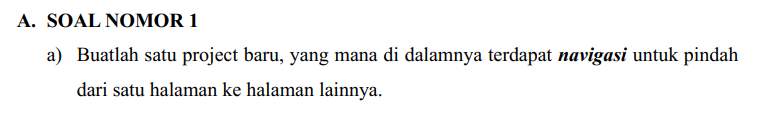

<div style="text-align: center;">

#### TUGAS PENDAHULUAN  
#### PEMROGRAMAN PERANGKAT BERGERAK  
#### MODUL VII  
#### NAVIGASI & NOTIFIKASI  


**Disusun Oleh:**  
**Gideon Toranawa Ladiyo / 2211104022**  
**SE0601** 

**Asisten Praktikum:**  
Muhammad Faza Zulian Gesit Al Barru  
Aisyah Hasna Aulia  

**Dosen Pengampu:**  
Yudha Islami Sulistya, S.Kom., M.Cs.  


**PROGRAM STUDI S1 SOFTWARE ENGINEERING**  
**FAKULTAS INFORMATIKA**  
**TELKOM UNIVERSITY PURWOKERTO**  
**2024**

</div>

---

soal:



Source Code `main.dart`:
```
import 'package:flutter/material.dart';
import 'package:tp_pertemuan7/secondPage.dart';

void main() {
  runApp(const MyApp());
}

class MyApp extends StatelessWidget {
  const MyApp({super.key});

  @override
  Widget build(BuildContext context) {
    return MaterialApp(
      title: 'Flutter Demo',
      theme: ThemeData(
        colorScheme: ColorScheme.fromSeed(seedColor: Colors.deepPurple),
        useMaterial3: true,
      ),
      home: const MyHomePage(title: 'Flutter Demo Home Page'),
    );
  }
}

class MyHomePage extends StatefulWidget {
  const MyHomePage({super.key, required this.title});
  final String title;

  @override
  State<MyHomePage> createState() => _MyHomePageState();
}

class _MyHomePageState extends State<MyHomePage> {
  @override
  Widget build(BuildContext context) {
    return Scaffold(
      appBar: AppBar(
        title: const Text("Latihan Navigasi"),
        centerTitle: true,
        backgroundColor: Colors.amber,
      ),
      body: Center(
        child: ElevatedButton(
          onPressed: () {
            Navigator.push(
              context,
              MaterialPageRoute(
                builder: (context) => const SecondPage(),
              ),
            );
          },
          style: ElevatedButton.styleFrom(
            minimumSize: const Size(150, 75),
            backgroundColor: Colors.amber,
          ),
          child: const Text(
            "Lanjut",
            style: TextStyle(fontSize: 18),
          ),
        ),
      ),
    );
  }
}
```

Source code `secondPage.dart`:
```
import 'package:flutter/material.dart';

class SecondPage extends StatelessWidget {
  const SecondPage({super.key});

  @override
  Widget build(BuildContext context) {
    return Scaffold(
      appBar: AppBar(
        title: const Text("Halaman Kedua"),
        backgroundColor: Colors.amber,
      ),
      body: Center(
        child: Column(
          mainAxisAlignment: MainAxisAlignment.center,
          children: const [
            Text(
              "Judul Halaman Kedua",
              style: TextStyle(
                fontSize: 20,
                fontWeight: FontWeight.bold,
              ),
            ),
            SizedBox(height: 20),
            Text("Ini deskripsi halaman kedua"),
          ],
        ),
      ),
    );
  }
}
```

Screenshot Output:


Penjelasan:
Di main kita membuat elevated button yang nantinya akan kita gunakan untuk navigasi ke halaman selanjutnya. Pada bagian onPressed kita buat kode untuk melakukan navigasi ke halaman `secondPage()`. Ketika tombol ditekan maka akan berpindah ke halaman secondPage()