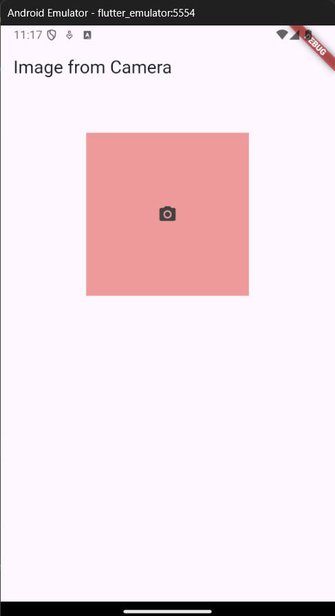
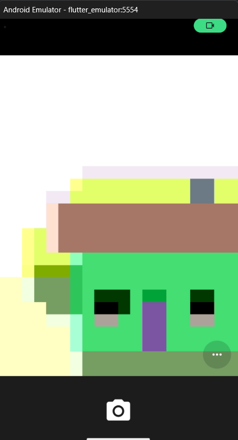
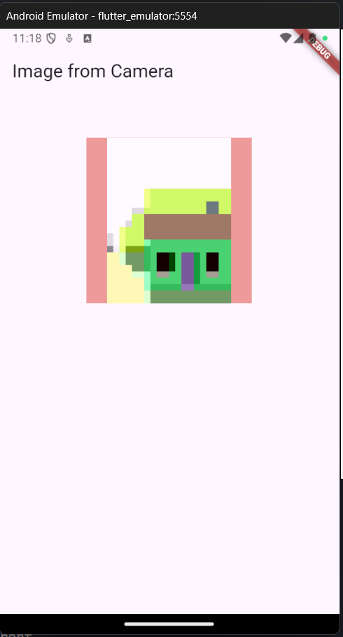
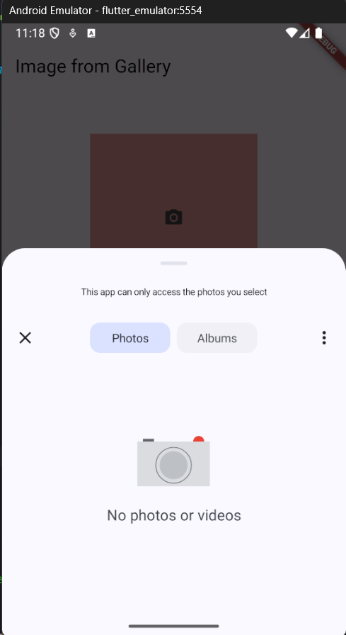
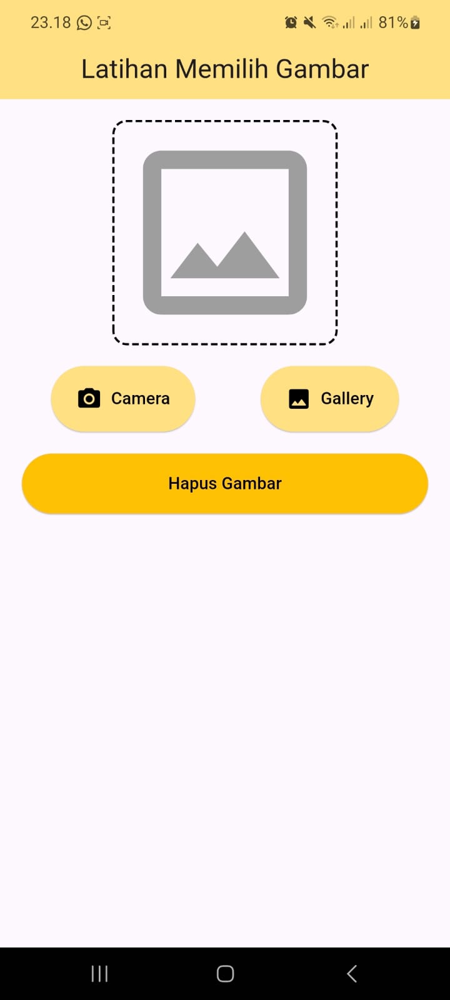
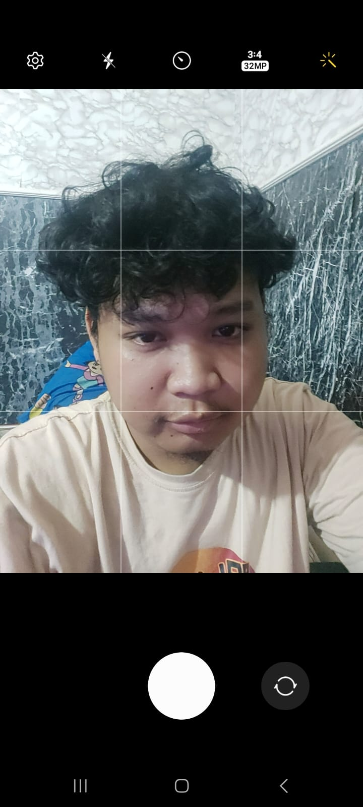
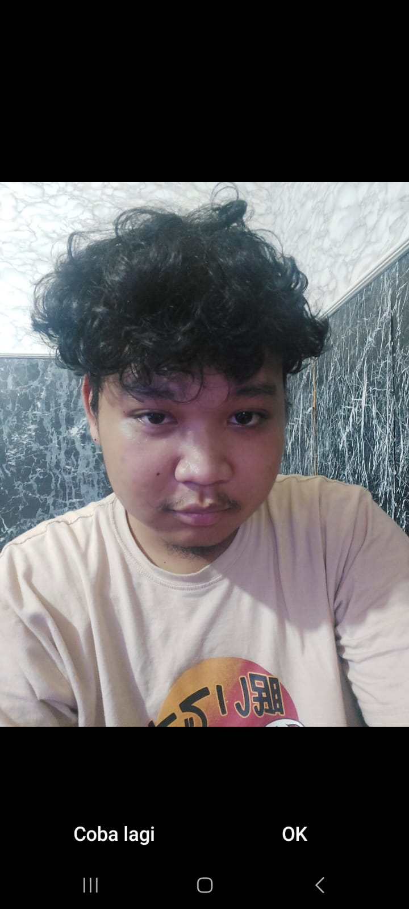
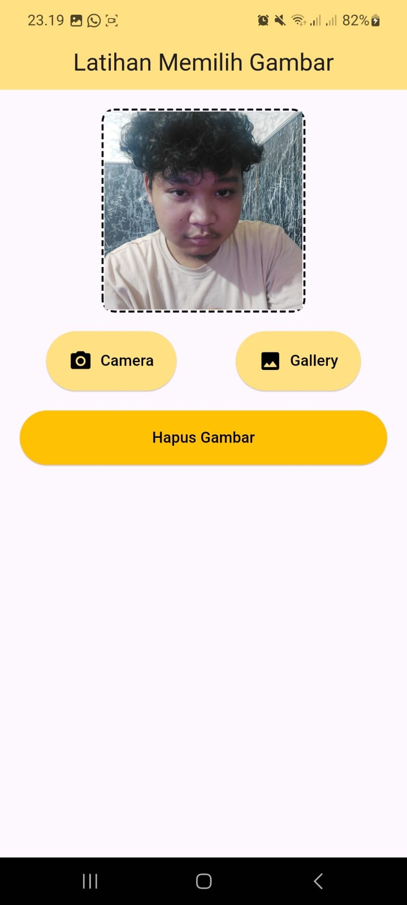
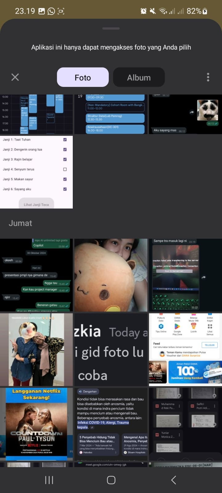
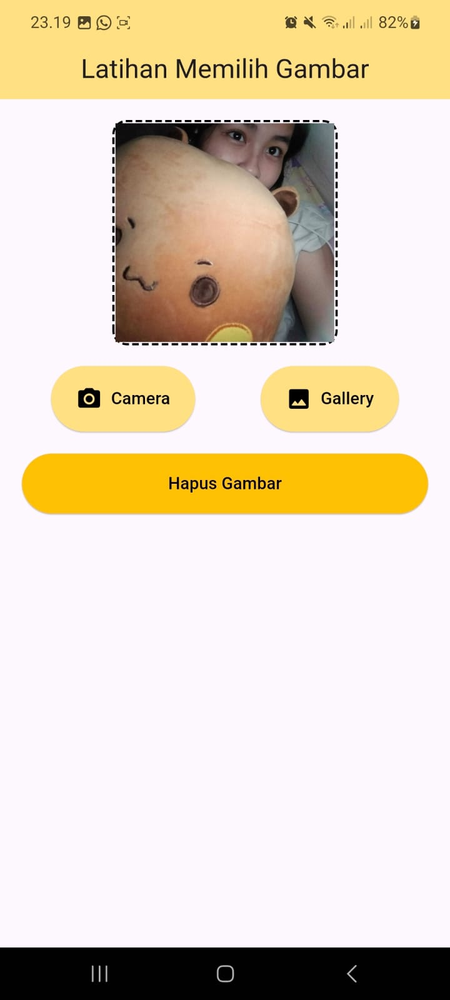

# Laporan Praktikum Pemrograman Perangkat Bergerak
## API Perangkat Keras
### Guided

Membuat aplikasi yang dapat menggunakan kamera dan gallery untuk mengambil gambar. Source Code:
```
import 'dart:io';
import 'package:flutter/material.dart';
import 'package:image_picker/image_picker.dart';

class ImageFromGalleryEx extends StatefulWidget {
  final type; 
  const ImageFromGalleryEx(this.type, {super.key});

  @override
  ImageFromGalleryExState createState() => ImageFromGalleryExState(this.type);
}

class ImageFromGalleryExState extends State<ImageFromGalleryEx> {
  var _image;
  var imagePicker;
  var type;

  ImageFromGalleryExState(this.type);

  @override
  void initState() {
    super.initState();
    imagePicker = ImagePicker();
  }

  @override
  Widget build(BuildContext context) {
    return Scaffold(
      appBar: AppBar(
        title: Text(type == ImageSource.camera
            ? "Image from Camera"
            : "Image from Gallery"),
      ),
      body: Column(
        children: <Widget>[
          SizedBox(height: 52),
          Center(
            child: GestureDetector(
              onTap: () async {
                var image = await imagePicker.pickImage(
                  source: type,
                  imageQuality: 50,
                  preferredCameraDevice: CameraDevice.front,
                );
                if (image != null) {
                  setState(() {
                    _image = File(image.path);
                  });
                } else {
                  // Tambahkan log atau pemberitahuan jika diperlukan
                  print("No image selected.");
                }
              },
              child: Container(
                width: 200,
                height: 200,
                decoration: BoxDecoration(color: Colors.red[200]),
                child: _image != null
                    ? Image.file(
                        _image,
                        width: 200.0,
                        height: 200.0,
                        fit: BoxFit.fitHeight,
                      )
                    : Container(
                        decoration: BoxDecoration(color: Colors.red[200]),
                        width: 200,
                        height: 200,
                        child: Icon(
                          Icons.camera_alt,
                          color: Colors.grey[800],
                        ),
                      ),
              ),
            ),
          )
        ],
      ),
    );
  }
}
```

Pertama deklarasi variabel untuk tipe cara pengambilan gambar. Gunakan package `ImagePicker` untuk dapat mengakses kamera atau gellery. buat objek `imagePicker` dari package ImagePicker. Ketika widget `GestureDetector` ditekan, variabel image akan diambil dari image picker berdasarkan tipe yang dipilih (Gallery atau Camera). Kemudian set image menjadi image yang kita ambil untuk ditampilkan, buat kondisi else ketika image tidak dipilih. Image akan ditampilkan, jika null maka hanya menampilkan container.

Output:





 


---

### Unguided

Memodifikasi TP9 agar dapat mengambil gambar dari kamera, galeri dan dapat menghapusnya.
Source Code:
```
import 'dart:io';

import 'package:flutter/material.dart';
import 'package:dotted_border/dotted_border.dart';
import 'package:image_picker/image_picker.dart';
import 'package:tp9/myapi_page.dart';
import 'image_from_gallery.dart';

void main() {
  runApp(const MyApp());
}

class MyApp extends StatelessWidget {
  const MyApp({super.key});

  // This widget is the root of your application.
  @override
  Widget build(BuildContext context) {
    return MaterialApp(
        title: 'Flutter Demo',
        theme: ThemeData(
          colorScheme: ColorScheme.fromSeed(seedColor: Colors.deepPurple),
          useMaterial3: true,
        ),
        // home: const MyHomePage(title: "latihan",)
        home: ImageFromGalleryEx(ImageSource.gallery)
        );
  }
}

class MyHomePage extends StatefulWidget {
  const MyHomePage({super.key, required this.title});

  final String title;

  @override
  State<MyHomePage> createState() => _MyHomePageState();
}

class _MyHomePageState extends State<MyHomePage> {
  File? _image; // Variabel untuk menyimpan gambar yang dipilih
  var imagePicker;
  var type;

  Future<void> _getImage(ImageSource source) async {
    final result = await Navigator.push(
      context,
      MaterialPageRoute(
        builder: (context) => ImageFromGalleryEx(source),
      ),
    );

    if (result != null && result is File) {
      setState(() {
        _image = result;
      });
    }
  }

  void initState() {
    super.initState();
    imagePicker = ImagePicker();
  }

  @override
  Widget build(BuildContext context) {
    return Scaffold(
      appBar: AppBar(
        centerTitle: true,
        title: Text('Latihan Memilih Gambar'),
        backgroundColor: Colors.amber[200],
      ),
      body: Padding(
        padding: const EdgeInsets.all(20.0),
        child: Column(
          children: [
            DottedBorder(
              borderType: BorderType.RRect,
              radius: Radius.circular(12),
              dashPattern: [6, 3],
              color: Colors.black,
              strokeWidth: 2,
              child: _image != null
                  ? Image.file(
                    height: 200,
                    width: 200,
                      _image!,
                      fit: BoxFit.cover,
                    )
                  : const Icon(
                      Icons.image_outlined,
                      size: 200,
                      color: Colors.grey,
                    ),
            ),
            SizedBox(height: 20),
            Row(
              mainAxisAlignment: MainAxisAlignment.center,
              children: [
                ElevatedButton(
                  onPressed: () async {
                    var image = await imagePicker.pickImage(
                      source: ImageSource.camera,
                      imageQuality: 50,
                      preferredCameraDevice: CameraDevice.front,
                    );
                    if (image != null) {
                      setState(() {
                        _image = File(image.path);
                      });
                    } else {
                      // Tambahkan log atau pemberitahuan jika diperlukan
                      print("No image selected.");
                    }
                  },
                  style: ElevatedButton.styleFrom(
                      minimumSize: Size(65, 60),
                      backgroundColor: Colors.amber[200]),
                  child: Row(
                    children: [
                      Icon(Icons.camera_alt, color: Colors.black),
                      SizedBox(width: 8),
                      Text(
                        'Camera',
                        style: TextStyle(color: Colors.black),
                      ),
                    ],
                  ),
                ),
                SizedBox(width: 60),
                ElevatedButton(
                  onPressed: () async {
                    var image = await imagePicker.pickImage(
                      source: ImageSource.gallery,
                      imageQuality: 50,
                      preferredCameraDevice: CameraDevice.front,
                    );
                    if (image != null) {
                      setState(() {
                        _image = File(image.path);
                      });
                    } else {
                      // Tambahkan log atau pemberitahuan jika diperlukan
                      print("No image selected.");
                    }
                  },
                  style: ElevatedButton.styleFrom(
                      minimumSize: Size(65, 60),
                      backgroundColor: Colors.amber[200]),
                  child: Row(
                    children: [
                      Icon(Icons.photo_rounded, color: Colors.black),
                      SizedBox(width: 8),
                      Text(
                        'Gallery',
                        style: TextStyle(color: Colors.black),
                      ),
                    ],
                  ),
                ),
              ],
            ),
            SizedBox(height: 20),
            ElevatedButton(
              onPressed: () {
                setState(() {
                  _image = null; // Menghapus gambar
                });
              },
              style: ElevatedButton.styleFrom(
                backgroundColor: Colors.amber,
                minimumSize: Size(400, 55),
              ),
              child: Text(
                'Hapus Gambar',
                style: TextStyle(color: Colors.black),
              ),
            ),
          ],
        ),
      ),
    );
  }
}
```

Sama seperti guided, di sini hanya perlu menambahkan fungsi agar dapat mengambil gambar pada onTap di tiap button berdasarkan tipe masing-masing. Untuk menghapus gambar, hanya perlu mengubah image yang diambil menjadi null.

Output:






