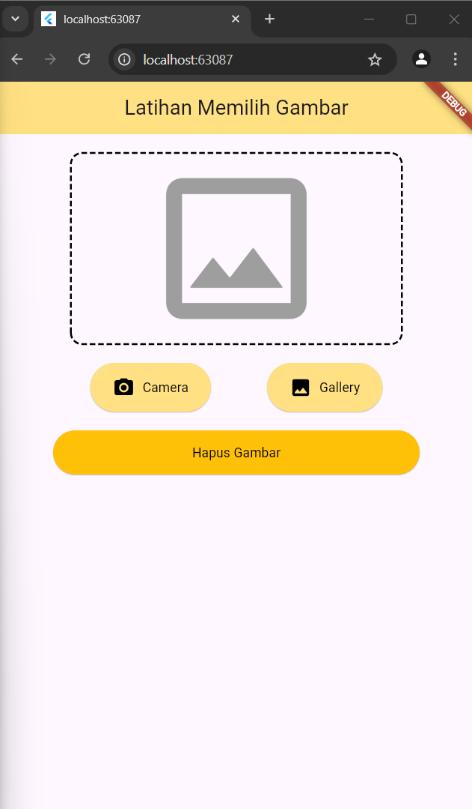

<div style="text-align: center;">

#### TUGAS PENDAHULUAN  
#### PEMROGRAMAN PERANGKAT BERGERAK  
#### MODUL IX
#### API PERANGKAT BERGERAK  


**Disusun Oleh:**  
**Nama Lengkap / NIM**  
**Kelas**  

**Asisten Praktikum:**  
Muhammad Faza Zulian Gesit Al Barru  
Aisyah Hasna Aulia  

**Dosen Pengampu:**  
Yudha Islami Sulistya, S.Kom., M.Cs.  


**PROGRAM STUDI S1 SOFTWARE ENGINEERING**  
**FAKULTAS INFORMATIKA**  
**TELKOM UNIVERSITY PURWOKERTO**  
**2024**

</div>

---

hasil:





Source Code:

```
import 'package:flutter/material.dart';
import 'package:dotted_border/dotted_border.dart';

void main() {
  runApp(MyApp());
}

class MyApp extends StatelessWidget {
  @override
  Widget build(BuildContext context) {
    return MaterialApp(
      home: Scaffold(
        appBar: AppBar(
          centerTitle: true,
          title: Text('Latihan Memilih Gambar'),
          backgroundColor: Colors.amber[200],
        ),
        body: Padding(
          padding: const EdgeInsets.all(20.0),
          child: Column(
            children: [
              DottedBorder(
                borderType: BorderType.RRect,
                radius: Radius.circular(12),
                dashPattern: [6, 3],
                color: Colors.black,
                strokeWidth: 2,
                child: Container(
                  width: 350,
                  height: 200,
                  // color: Colors.white,
                  child: const Icon(
                    Icons.image_outlined,
                    size: 200,
                    color: Colors.grey,
                  ),
                ),
              ),
              SizedBox(height: 20),
              Row(
                mainAxisAlignment: MainAxisAlignment.center,
                children: [
                  ElevatedButton(
                    onPressed: () {},
                    style: ElevatedButton.styleFrom(
                      minimumSize: Size(65, 60),
                        backgroundColor: Colors.amber[200]),
                    child: Row(
                      children: [
                        Icon(Icons.camera_alt, color: Colors.black),
                        SizedBox(width: 8),
                        Text(
                          'Camera',
                          style: TextStyle(color: Colors.black),
                        ),
                      ],
                    ),
                  ),
                  SizedBox(width: 60),
                  ElevatedButton(
                    onPressed: () {},
                    style: ElevatedButton.styleFrom(
                      minimumSize: Size(65, 60),
                        backgroundColor: Colors.amber[200]),
                    child: Row(
                      children: [
                        Icon(Icons.photo_rounded, color: Colors.black),
                        SizedBox(width: 8),
                        Text(
                          'Gallery',
                          style: TextStyle(color: Colors.black),
                        ),
                      ],
                    ),
                  ),
                ],
              ),
              SizedBox(height: 20),
              ElevatedButton(
                onPressed: () {},
                style: ElevatedButton.styleFrom(
                  backgroundColor: Colors.amber,
                  minimumSize: Size(400, 55),
                ),
                child: Text(
                  'Hapus Gambar',
                  style: TextStyle(color: Colors.black),
                ),
              ),
            ],
          ),
        ),
      ),
    );
  }
}
```

Untuk membuat UI seperti pada soal, kita perlu package bernama `dotted_border` untuk membuat outline putus-putus. Masukkan `dotted_border: ^2.1.0` ke dalam file `pubspec.yaml` kemudian masukkan command `flutter pub add dotted_border` pada terminal untuk mengimpor package. Seperti biasa buat UI dengan memakai scaffold dengan body column agar widget berada dalam satu baris. Panggil widget `DottedBorder` untuk memanggil widget yang akan dimasukkan outline putus-putus, kemudian buat 3 elevated button untuk tombol. Beri style pada masing-masing widget agar cantik.