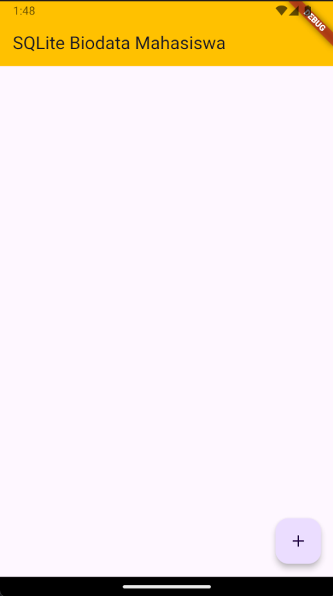
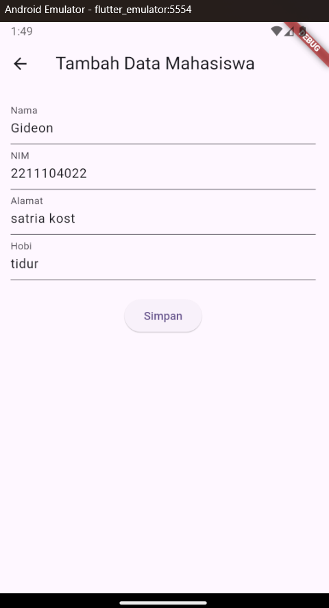

# Laporan Praktikum 10 Pemrograman Perangkat Bergerak
---
## Guided
Pertama buat file `db_helper.dart` yang akan digunakan untuk inisiasi database hingga melakukan operasi CRUD(Create Read Update Delete). Kita akan menggunakan package `sqllite` dan `path` untuk mendukung praktikum ini. Import package ke file `pubspec.yaml` pada bagian depedencies seperti berikut:
```
dependencies:
  flutter:
    sdk: flutter
  sqflite: ^2.4.1
  path: ^1.9.0
```

Kemudian jalankan perintah `flutter pub get` untuk mengimport package yang ada di depedencies. Kembali ke db_helper, buat class `DatabaseHelper` kemudian lakukan inisiasi database, create table, hingga delete table seperti berikut:
```
class DatabaseHelper {
  static final DatabaseHelper _instance = DatabaseHelper._internal();
  static Database? _database;

  factory DatabaseHelper() {
    return _instance;
  }

  DatabaseHelper._internal();

  Future<Database> get database async {
    if (_database == null) {
      _database = await _initDatabase();
    }
    return _database!;
  }

  Future<Database> _initDatabase() async {
    String path = join(await getDatabasesPath(), 'my_prakdatabase.db');

    return await openDatabase(
      path,
      version: 1,
      onCreate: _onCreate,
    );
  }

  Future<void> _onCreate(Database db, int version) async {
    await db.execute('''
        CREATE TABLE my_table(
          id INTEGER PRIMARY KEY AUTOINCREMENT NOT NULL,
          title TEXT,
          description TEXT,
          createdAt TIMESTAMP NOT NULL DEFAULT CURRENT_TIMESTAMP
        )
      ''');
  }

  Future<int> insert(Map<String, dynamic> row) async {
    Database db = await database;
    return await db.insert('my_table', row);
  }

  Future<List<Map<String, dynamic>>> queryAllRows() async {
    Database db = await database;
    return await db.query('my_table');
  }

  Future<int> update(Map<String, dynamic> row) async {
    Database db = await database;
    int id = row['id'];
    return await db.update('my_table', row, where: 'id = ?', whereArgs: [id]);
  }

  Future<int> delete(int id) async {
    Database db = await database;
    return await db.delete('my_table', where: 'id = ?', whereArgs: [id]);
  }

  Future<List<Map<String, dynamic>>> getItem(int id) async {
    Database db = await database;
    return await db.query('my_table', where: "id = ?", whereArgs: [id], limit: 1);
  }
}
```

Kemudian buat file `my_db_view.dart` untuk membuat tampilan agar dapat menjalankan opreasi sqllite. 
Source Code:
```
import 'package:flutter/foundation.dart';
import 'package:flutter/material.dart';
import 'package:pertemuan10/db_helper.dart';

class MyDatabaseView extends StatefulWidget {
  const MyDatabaseView({super.key});

  @override
  State<MyDatabaseView> createState() => _MyDatabaseViewState();
}

class _MyDatabaseViewState extends State<MyDatabaseView> {

  final DatabaseHelper dbHelper = DatabaseHelper();
  List<Map<String, dynamic>> _dbData = [];
  final TextEditingController _titleController = TextEditingController();
  final TextEditingController _descriptionController = TextEditingController();

  @override

  void initState() {
    _refreshData();
    super.initState();
  }

  void _refreshData() async{
    final data = await dbHelper.queryAllRows();
    setState(() {
      _dbData = data;
    });
  }

  void dispose(){
    _titleController.dispose();
    _descriptionController.dispose();
  }

  void _addData() async {
    await dbHelper.insert({
      'title': _titleController.text,
      'description': _descriptionController.text.codeUnits,
    });
    _titleController.clear();
    _descriptionController.clear();
    _refreshData();
  }

  void _updateData(int id) async {
    await dbHelper.update({
      'id': id,
      'title': _titleController.text,
      'description': _descriptionController.text,
    });
    _titleController.clear();
    _descriptionController.clear();
    _refreshData();
  }

  void _deleteData(int id) async {
    await dbHelper.delete(id);
    _refreshData();
  }

  void _showEditingDialog(Map<String, dynamic> item) {
    _titleController.text = item['title'];
    _descriptionController.text = item['description'];

    showDialog(
      context: context,
      builder: (context) {
        return AlertDialog(
          title: Text("Edit Item"),
          content: Column(
            mainAxisSize: MainAxisSize.min,
            children: [
              TextField(
                controller: _titleController,
                decoration: InputDecoration(
                  labelText: "Title"
                ),
              ),
              TextField(
                controller: _descriptionController,
                decoration: InputDecoration(
                  labelText: "Description"
                ),
              )
            ],
          ),
          actions: [
            TextButton(
              onPressed: () {
                Navigator.of(context).pop();
              },
              child: Text("Cancel"),
            ),
            TextButton(
              onPressed: () {
                _updateData(item['id']);
                Navigator.of(context).pop();
              },
              child: Text("Save"))
          ],
        );
      }
    );
  }

  Widget build(BuildContext context) {
    return Scaffold(
      appBar: AppBar(
        title: Text(
          "Database"
        ),
      ),
      body: Column(
        children: [
          Padding(
            padding: const EdgeInsets.all(8),
            child: TextField(
              controller: _titleController,
              decoration: InputDecoration(labelText: "Title"),
            ),
          ),
          Padding(
            padding: const EdgeInsets.all(8),
            child: TextField(
              controller: _descriptionController,
              decoration: InputDecoration(labelText: "Description"),
            ),
          ),
          Expanded(
            child: ListView.builder(
              itemCount: _dbData.length,
              itemBuilder: (context, index){
                final item = _dbData[index];
                return ListTile(
                  title: Text(item['title']),
                  subtitle: Text(item['description']),
                  trailing: Row(
                    mainAxisSize: MainAxisSize.min,
                    children: [
                      IconButton(
                        icon: Icon(Icons.edit),
                        onPressed: () {
                          _showEditingDialog(item);
                        },
                      ),
                      IconButton(
                        icon: Icon(Icons.delete),
                        onPressed: () {
                          _deleteData(item['id']);
                        },
                      )
                    ],
                  ),
                );
              },
            ),
          )
        ],
      ),
    );
  }
}
```

---

## Unguided

### Soal
Buatlah sebuah project aplikasi Flutter dengan SQLite untuk menyimpan data biodata mahasiswa yang terdiri dari nama, NIM, domisili, dan hobi. Data yang dimasukkan melalui form akan ditampilkan dalam daftar di halaman utama.
Alur:
1. Form Input: Buat form input untuk menambahkan biodata mahasiswa, dengan kolom:
Nama
Nim
Alamat
Hobi
2. Tampilkan Daftar Mahasiswa: Setelah data berhasil ditambahkan, tampilkan daftar semua data mahasiswa yang sudah disimpan di halaman utama.
3. Implementasikan fitur Create (untuk menyimpan data mahasiswa) dan Read (untuk menampilkan daftar mahasiswa yang sudah disimpan).


### Jawaban

Pertama buat proyek flutter dan buat struktur file di dalam folder lib seperti berikut:
```
lib/
|-- main.dart
|-- screens/
|   |-- home.dart
|   |-- add_student.dart
|-- database/
    |-- db_helper.dart
```

Kemudian kita inisisasi database seperti pada guided pada file `db_helper.dart`. Terapkan kode pada guided dengan mengubah sedikit menjadi seperti berikut:
```
import 'package:sqflite/sqflite.dart';
import 'package:path/path.dart';

class DatabaseHelper {
  static final DatabaseHelper _instance = DatabaseHelper._internal();
  static Database? _database;

  factory DatabaseHelper() {
    return _instance;
  }

  DatabaseHelper._internal();

  Future<Database> get database async {
    if (_database == null) {
      _database = await _initDatabase();
    }
    return _database!;
  }

  Future<Database> _initDatabase() async {
    String path = join(await getDatabasesPath(), 'mahasiswa.db');

    return await openDatabase(
      path,
      version: 1,
      onCreate: _onCreate,
    );
  }

  Future<void> _onCreate(Database db, int version) async {
    await db.execute('''
        CREATE TABLE students(
          id INTEGER PRIMARY KEY AUTOINCREMENT NOT NULL,
          nama TEXT NOT NULL,
          nim TEXT NOT NULL,
          alamat TEXT NOT NULL,
          hobi TEXT NOT NULL
        )
      ''');
  }

  Future<int> insert(Map<String, dynamic> row) async {
    Database db = await database;
    return await db.insert('students', row);
  }

  Future<List<Map<String, dynamic>>> queryAllRows() async {
    Database db = await database;
    return await db.query('students');
  }

  Future<int> update(Map<String, dynamic> row) async {
    Database db = await database;
    int id = row['id'];
    return await db.update('students', row, where: 'id = ?', whereArgs: [id]);
  }

  Future<int> delete(int id) async {
    Database db = await database;
    return await db.delete('students', where: 'id = ?', whereArgs: [id]);
  }

  Future<List<Map<String, dynamic>>> getItem(int id) async {
    Database db = await database;
    return await db.query('students',
        where: "id = ?", whereArgs: [id], limit: 1);
  }
}
```

Kemudian pada folder screen, buat tampilan home yang akan menjadi tempat tampil data dari database. Data dari database akan diambil menggunakan fungsi `queryAllRows()` di db_helper.dart, kemudian fungsi dijalankan ketika direfresh untuk memasukkan output fungsi `querryAllRows()` ke dalam list dictionary yang berisi kolom-kolom pada data. Kemudian dari list, akan dibuat widget `Listview.builder` dengan mengambil masing-masing dictionary menjadi widget `ListTile`. Kemudian buat tombol untuk berpindah ke page tambah data.
Source code:
```
import 'package:flutter/material.dart';
import 'package:unguided10/screens/add_student.dart';
import '../database/db_helper.dart';
import 'add_student.dart';

class HomeScreen extends StatefulWidget {
  @override
  _HomeScreenState createState() => _HomeScreenState();
}

class _HomeScreenState extends State<HomeScreen> {
  final DatabaseHelper dbHelper = DatabaseHelper();
  List<Map<String, dynamic>> _dbData = [];

  @override
  void initState() {
    super.initState();
    _refreshData();
  }

  void _refreshData() async {
    final data = await dbHelper.queryAllRows();
    setState(() {
      _dbData = data;
    });
  }

  void _deleteData(int id) async {
    await dbHelper.delete(id);
    _refreshData();
  }

  @override
  Widget build(BuildContext context) {
    return Scaffold(
      appBar: AppBar(
        backgroundColor: Colors.amber,
        title: Text("SQLite Biodata Mahasiswa"),
      ),
      body: ListView.builder(
        itemCount: _dbData.length,
        itemBuilder: (context, index) {
          final item = _dbData[index];
          return Card(
            margin: EdgeInsets.all(8.0),
            child: ListTile(
              title: Text(item['nama']),
              subtitle: Column(
                crossAxisAlignment: CrossAxisAlignment.start,
                children: [
                  Text("NIM: ${item['nim']}"),
                  Text("Alamat: ${item['alamat']}"),
                  Text("Hobi: ${item['hobi']}"),
                ],
              ),
              trailing: IconButton(
                icon: Icon(Icons.delete),
                onPressed: () {
                  _deleteData(item['id']);
                },
              ),
            ),
          );
        },
      ),
      floatingActionButton: FloatingActionButton(
        onPressed: () {
          Navigator.push(
            context,
            MaterialPageRoute(
              builder: (context) => AddStudentPage(
                refreshData: _refreshData,
              ),
            ),
          );
        },
        child: Icon(Icons.add),
      ),
    );
  }
}
```

Pada page tambah data, buat tampilan form untuk melakukan input data. Masing-masing form akan dibuat controller terlebih dahulu, kemudian ketika menekan tombol simpan, tombol akan melakukan fungsi `addData` yang dimana fungsi ini bertujuan untuk melakukan insert data ke database. Fungsi ini juga memanggil fungsi `refreshData` agar data yang dipanggil diperbaharui.
Source code:
```
import 'package:flutter/material.dart';
import '../database/db_helper.dart';

class AddStudentPage extends StatefulWidget {
  final Function refreshData;

  AddStudentPage({required this.refreshData});

  @override
  _AddStudentPageState createState() => _AddStudentPageState();
}

class _AddStudentPageState extends State<AddStudentPage> {
  final DatabaseHelper dbHelper = DatabaseHelper();
  final TextEditingController _nameController = TextEditingController();
  final TextEditingController _nimController = TextEditingController();
  final TextEditingController _addressController = TextEditingController();
  final TextEditingController _hobbyController = TextEditingController();

  void _addData() async {
    await dbHelper.insert({
      'nama': _nameController.text,
      'nim': _nimController.text,
      'alamat': _addressController.text,
      'hobi': _hobbyController.text,
    });

    widget.refreshData();
    Navigator.pop(context);
  }

  @override
  void dispose() {
    _nameController.dispose();
    _nimController.dispose();
    _addressController.dispose();
    _hobbyController.dispose();
    super.dispose();
  }

  @override
  Widget build(BuildContext context) {
    return Scaffold(
      appBar: AppBar(
        backgroundColor: Colors.amber,
        title: Text("Tambah Data Mahasiswa"),
      ),
      body: Padding(
        padding: const EdgeInsets.all(16.0),
        child: Column(
          children: [
            TextField(
              controller: _nameController,
              decoration: InputDecoration(labelText: "Nama"),
            ),
            TextField(
              controller: _nimController,
              decoration: InputDecoration(labelText: "NIM"),
            ),
            TextField(
              controller: _addressController,
              decoration: InputDecoration(labelText: "Alamat"),
            ),
            TextField(
              controller: _hobbyController,
              decoration: InputDecoration(labelText: "Hobi"),
            ),
            SizedBox(height: 20),
            ElevatedButton(
              onPressed: _addData,
              child: Text("Simpan"),
            ),
          ],
        ),
      ),
    );
  }
}
```

Output:








