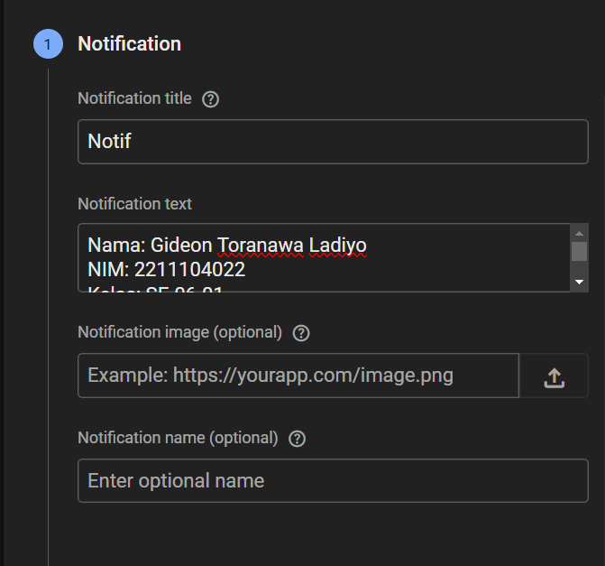
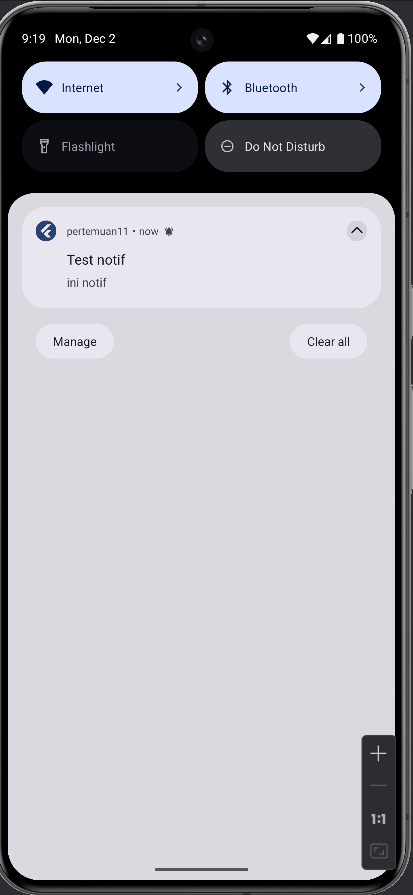
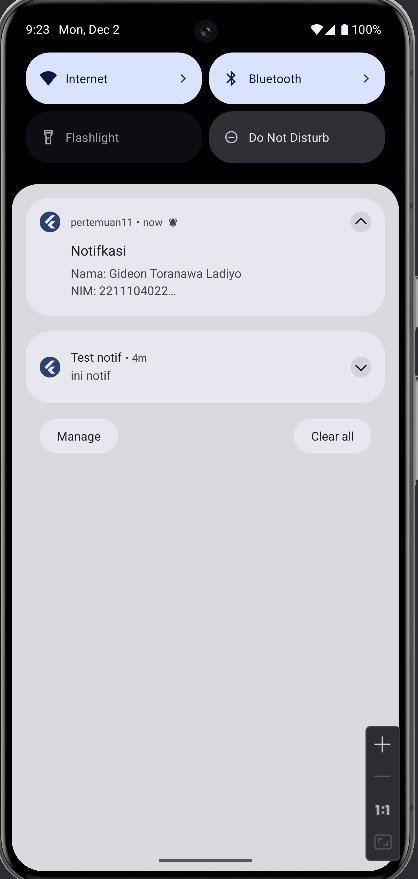

# Laporan Praktikum Pemrograman Perangkat Bergerak
---
## GUIDED
Untuk membuat notifikasi menggunakan firebase, kita akan melakukan beberapa langkah berikut:
1. kita perlu membuat project baru di firebase. Untuk android package name, bisa ditemukan di file `build.gradle` pada direktori `android/app/`
2. Setelah berhasil mendaftarkan aplikasi ke firebase, download file google-services.json lalu simpan pada `android/app/`
3. Tambahkan plugin dan sdk sesuai perintah pada `android/build.gradle` dan `android/app/build.gradle` lalu lakukan sync dengan mengetik `“flutter pub get”` pada terminal.
4. Setelah memodifikasi file build.gradle, tambahkan beberapa package pada file pubspec.yaml dengan mengetik `“flutter pub add firebase_core firebase_messaging flutter_local_notifications”` pada terminal.
5. Ubah compile sdk agar menggunakan versi 33 dan min sdk pada versi 21 yang terletak pada file `./android/app/build.gradle` 
``` 
minSdkVersion 21
targetSdkVersion 33 
```
6. buat notifikasi handler, tambahkan kode di fungsi main() untuk memastikan Firebase dan konfigurasi lainnya sudah siap digunakan
```
void main() async {
  WidgetsFlutterBinding.ensureInitialized();
  await Firebase.initializeApp();

  // Set up background message handler
  FirebaseMessaging.onBackgroundMessage(_firebaseMessagingBackgroundHandler);

  // Create notification channel for Android
  const AndroidNotificationChannel channel = AndroidNotificationChannel(
    'high_importance_channel', // ID Channel
    'High Importance Notifications', // Nama Channel
    description:
    'This channel is used for important notifications.', // Deskripsi Channel
    importance: Importance.high, // Prioritas
  );

  final FlutterLocalNotificationsPlugin flutterLocalNotificationsPlugin =
  FlutterLocalNotificationsPlugin();

  await flutterLocalNotificationsPlugin
      .resolvePlatformSpecificImplementation<
      AndroidFlutterLocalNotificationsPlugin>()
      ?.createNotificationChannel(channel);

  await FirebaseMessaging.instance.setForegroundNotificationPresentationOptions(
    alert: true,
    badge: true,
    sound: true,
  );

  runApp(const MyApp());
}
```
7. Tambahkan kode berikut di bawah import sebagai variabel global.
```
Future<void> _firebaseMessagingBackgroundHandler(RemoteMessage message) async {
  await Firebase.initializeApp();
  print('Handling a background message: ${message.messageId}');
}
```
8. Di dalam kelas State, tambahkan konfigurasi untuk menangani notifikasi
```
void initState() {
    super.initState();
    myNotification = MyNotification();

    FirebaseMessaging.onMessage.listen((RemoteMessage message) {
      myNotification.showNotification(message);
    });

    FirebaseMessaging.onMessageOpenedApp.listen((RemoteMessage message) {
      RemoteNotification? notification = message.notification;
      AndroidNotification? android = message.notification?.android;
      if (notification != null && android != null) {
        showDialog(
          context: context,
          builder: (_) {
            return AlertDialog(
              title: Text(notification.title ?? ""),
              content: SingleChildScrollView(
                child: Column(
                  crossAxisAlignment: CrossAxisAlignment.start,
                  children: [Text(notification.body ?? "")],
                ),
              ),
            );
          },
        );
      }
    });

    getToken();
  }
```
9. Buat fille myNotifications dengan isi kode seperti berikut
```
import 'package:firebase_messaging/firebase_messaging.dart';
import 'package:flutter_local_notifications/flutter_local_notifications.dart';

class MyNotification {
  late FlutterLocalNotificationsPlugin flutterLocalNotificationsPlugin;

  MyNotification() {
    var initializationSettingsAndroid =
    const AndroidInitializationSettings('@mipmap/ic_launcher');
    var initializationSettings =
    InitializationSettings(android: initializationSettingsAndroid);
    flutterLocalNotificationsPlugin = FlutterLocalNotificationsPlugin();
    flutterLocalNotificationsPlugin.initialize(initializationSettings);
  }

  Future<void> showNotification(RemoteMessage message) async {
    RemoteNotification? notification = message.notification;
    AndroidNotification? android = message.notification?.android;
    if (notification != null && android != null) {
      flutterLocalNotificationsPlugin.show(
        notification.hashCode,
        notification.title,
        notification.body,
        NotificationDetails(
          android: AndroidNotificationDetails(
            'high_importance_channel',
            'High Importance Notifications',
            channelDescription:
            'This channel is used for important notifications.',
            icon: '@mipmap/ic_launcher',
          ),
        ),
      );
    }
  }
}
```
10. Buka halaman all product pada tab firebase --> pilih menu cloud messaging --> lalu pilih send your first message.
11. Selanjutnya, inputkan judul, pesan, dan foto dari notifikasi kalian sesuai dengan kebutuhan.

12. Setelah itu, pilih aplikasi mana yang akan dikirimkan notifikasi dan setting waktu "Now” jika ingin langsung mengirimkan notifikasi. Lalu klik publish jika isi dan settingan notifikasi sudah benar.
13. Silakan tunggu notifikasi muncul pada aplikasi. Catatan: pengiriman notifikasi memerlukan beberapa saat dan tidak akan langsung muncul setelah dikirim jadi silakan menunggu.
14. Contoh hasil notifikasi



---
## UNGUIDED

Modifikasi Guided diatas bisa menampilkan Nama, Nim, Kelas, dan Prodi kalian ke dalam Notifikasi Flutter Cloud Messaging dan landing page notifikasinya.

Sama seperti sebelumnya, buka firebase lalu buat notifikasi baru dengan isi notifikasi adalah Nama, Nim, Kelas, dan Prodi. Output:

