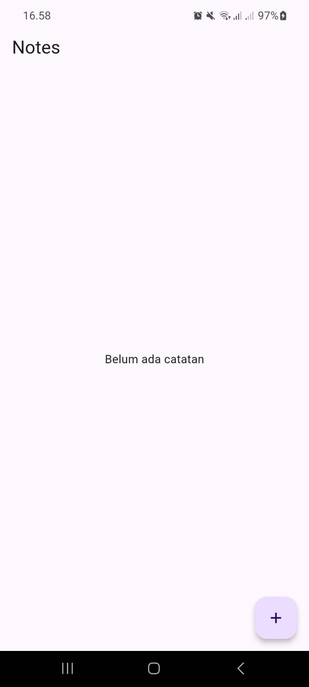
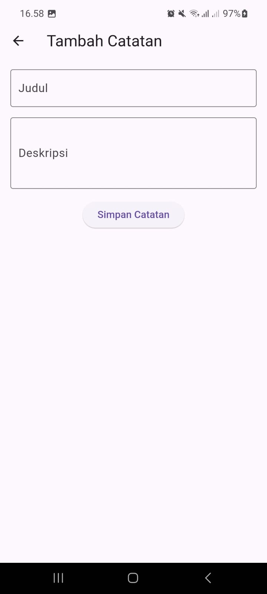
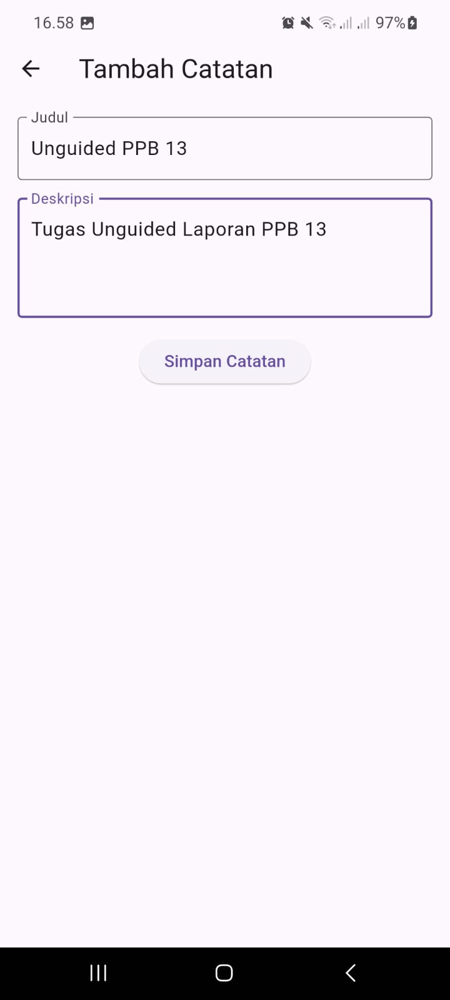
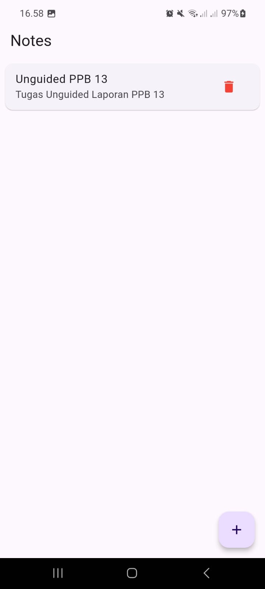

# Laporan Praktikum 13 Pemrograman Perangkat Bergerak
## Networking

---

### Unguided

#### SOAL
Buatlah Aplikasi Catatan Sederhana menggunakan GetX, dengan ketentuan sebagai berikut :
1. Halaman utama atau Homepage untuk menampilkan daftar catatan yang telah ditambahkan. Setiap catatan terdiri dari judul dan deskripsi singkat, serta terdapat tombol untuk menghapus catatan dari daftar.
2. Halaman kedua untuk menambah catatan baru, berisi : form untuk memasukkan judul dan deskripsi catatan, serta tombol untuk menyimpan catatan ke daftar (Homepage).
3. Menggunakan getx controller.
4. Menggunakan getx routing untuk navigasi halaman.

#### Jawaban
Untuk membuat state management yang baik, kita perlu membuat clean architecture pada project terlebih dahulu seperti berikut:
```
lib/
├── main.dart
├── app/
│   ├── controllers/
│   │   └── notes_controller.dart
│   ├── pages/
│   │   ├── homepage.dart         
│   │   └── add_note_page.dart     
│   ├── routes/
│   |    └── app_routes.dart
|   └── models/
│       └── notes.dart        

```
Keterangan: 
- `main.dart` untuk inisiasi awal
- `notes_controlller.dart` untuk controller notesnya
- `homepaage.dart` untuk tampilan list note
- `add_note_page.dart` untuk form tambah note
- `app_routesd.dart` untuk melakukan routing ke page lain
- `notes.dart` untuk membuat class note

Pertama buat class `Notes` untuk membuat objek dari note seperti berikut:
```dart
class Notes {
  int id;
  String title;
  String desc;

  Notes({
    required this.id,
    required this.title,
    required this.desc
  });
}
```
Kemudian buat controler untuk notesnya menggunakan package `Get` dari pub dev. Inisiasi controller untuk menyimpan list note, tambah dan hapus note seperti berikut:
```dart
import 'package:get/get.dart';
import 'package:unguided13/app/models/notes.dart';

class NotesController extends GetxController{
  var notes = <Notes>[].obs;

  void addNote(String title, String desc) {
    int id = notes.length + 1;
    notes.add(Notes(id: id, title: title, desc: desc));
  }

  void deleteNote(int id){
    notes.removeWhere((note) => note.id == id);
  }
}
```

Buat home page untuk menampilkan notes yang sudah dibuat. Kita menggunakan widget `Obx()` agar widget selalu berubah ketika ada perubahan pada list notes.
```dart
import 'package:flutter/foundation.dart';
import 'package:flutter/material.dart';
import 'package:flutter/widgets.dart';
import 'package:get/get.dart';
import 'package:unguided13/app/controllers/notes_controller.dart';
import 'package:unguided13/app/routes/app_routes.dart';

class HomePage extends StatelessWidget {
  HomePage({super.key});
  NotesController controller = Get.put(NotesController());
  
  @override
  Widget build(BuildContext context) {
    return Scaffold(
      appBar: AppBar(title: Text("Notes"),),
      body: Obx(() {
        if (controller.notes.isEmpty) {
          return Center(child: Text("Belum ada catatan"),);
        }
        return ListView.builder(
          itemCount: controller.notes.length,
          itemBuilder: (context, index){
            final note = controller.notes[index];
            return Card(
              margin: EdgeInsets.all(8),
              child: ListTile(
                title: Text(note.title),
                subtitle: Text(note.desc),
                trailing: IconButton(
                  icon: Icon(Icons.delete),
                  color: Colors.red,
                  onPressed: () => controller.deleteNote(note.id),
                ),
              ),
            );
          },
        );
      }),
      floatingActionButton: FloatingActionButton(
        onPressed: () => Get.toNamed(AppRoutes.addNote),
        child: Icon(Icons.add),
      ),
    );
  }
}
```

Buat page untuk menampilkan form menambah note.
```dart
import 'package:flutter/foundation.dart';
import 'package:flutter/material.dart';
import 'package:flutter/widgets.dart';
import 'package:get/get.dart';
import 'package:unguided13/app/controllers/notes_controller.dart';

class AddNotePage extends StatelessWidget {
  AddNotePage({super.key});
  final NotesController controller = Get.find();
  final TextEditingController titleController = TextEditingController();
  final TextEditingController descController = TextEditingController();

  @override
  Widget build(BuildContext context) {
    return Scaffold(
      appBar: AppBar(title: Text("Tambah Catatan"),),
      body: Padding(
        padding: EdgeInsets.all(16),
        child: Column(
          children: [
            TextField(
              controller: titleController,
              decoration: InputDecoration(
                labelText: 'Judul',
                border: OutlineInputBorder()
              ),
            ),
            SizedBox(height: 16,),
            TextField(
              controller: descController,
              decoration: InputDecoration(
                  labelText: 'Deskripsi', border: OutlineInputBorder()),
                  maxLines: 3,
            ),
            SizedBox(height: 16,),
            ElevatedButton(
              onPressed: () {
                if (titleController.text.isNotEmpty && descController.text.isNotEmpty){
                  controller.addNote(
                    titleController.text,
                    descController.text
                  );
                  Get.back();
                } else {
                  Get.snackbar(
                    'Error',
                    'Judul dan deskripsi harus diisi!',
                    snackPosition: SnackPosition.BOTTOM
                  );
                }
              },
              child: Text('Simpan Catatan'),
            ),
          ],
        ),
      ),
    );
  }
}
```

Setelah itu, buat file `app_routes.dart` untuk digunakan sebagai route ke page lain.
```dart
import 'package:get/get.dart';
import 'package:unguided13/app/pages/add_note_page.dart';
import 'package:unguided13/app/pages/homepage.dart';

class AppRoutes {
  static const home = '/';
  static const addNote = '/add-note';

  static final routes = [
    GetPage(name: home, page: () => HomePage()),
    GetPage(name: addNote, page: () => AddNotePage()),
  ];
}
```

Edit file `main.dart` dengan mengubah initial route ke home.
```dart
import 'package:flutter/material.dart';
import 'package:get/get.dart';
import 'app/routes/app_routes.dart';

void main() {
  runApp(MyApp());
}

class MyApp extends StatelessWidget {
  @override
  Widget build(BuildContext context) {
    return GetMaterialApp(
      debugShowCheckedModeBanner: false,
      title: 'Catatan Sederhana',
      initialRoute: AppRoutes.home,
      getPages: AppRoutes.routes,
    );
  }
}
```

Output:






