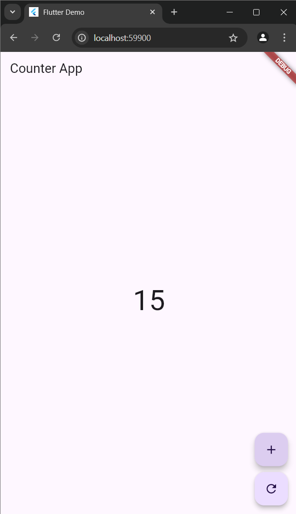

<div style="text-align: center;">

#### TUGAS PENDAHULUAN  
#### PEMROGRAMAN PERANGKAT BERGERAK  
#### MODUL XIII 
#### NETWORKING  


**Disusun Oleh:**  
**Gideon Toranawa Ladiyo / 2211104022**  
**SE-06-01**  

**Asisten Praktikum:**  
Muhammad Faza Zulian Gesit Al Barru  
Aisyah Hasna Aulia  

**Dosen Pengampu:**  
Yudha Islami Sulistya, S.Kom., M.Cs.  


**PROGRAM STUDI S1 SOFTWARE ENGINEERING**  
**FAKULTAS INFORMATIKA**  
**TELKOM UNIVERSITY PURWOKERTO**  
**2024**

</div>

---

### Jawaban

#### 1. **Apa yang dimaksud dengan state management pada Flutter?**
State management pada Flutter adalah teknik untuk mengelola dan memantau status atau data dari aplikasi selama siklus hidupnya. Status ini bisa berupa data yang berubah seperti nilai variabel, respons API, atau interaksi pengguna. Flutter menyediakan berbagai pendekatan untuk state management, seperti menggunakan *setState*, *Provider*, *Bloc*, atau *GetX*. GetX adalah salah satu library populer yang memberikan solusi sederhana dan reaktif untuk mengelola state, navigasi, dan dependency injection.

---

#### 2. **Sebut dan jelaskan komponen-komponen yang ada di dalam GetX.**

1. **State Management**:
   - GetX menggunakan pendekatan reaktif untuk mengelola state, di mana perubahan data langsung mencerminkan perubahan pada UI melalui widget seperti `Obx`.
2. **Dependency Injection**:
   - Dengan `Get.put` atau `Get.lazyPut`, kita dapat mengelola dan menginisialisasi objek secara global atau lokal dengan efisiensi memori.
3. **Navigation Management**:
   - Menggunakan `Get.to`, `Get.off`, atau `Get.back`, GetX menyediakan cara mudah untuk berpindah antar halaman tanpa memerlukan `BuildContext`.
4. **Reactive State**:
   - Menggunakan variabel reaktif seperti `RxInt`, `RxString`, atau `RxList` untuk membuat data menjadi reaktif.
5. **Controller**:
   - Sebagai tempat logika bisnis, `Controller` dikelola dengan `GetxController` untuk memisahkan logika dari UI.

---

#### 3. **Kode Lengkap:**

```dart
import 'package:flutter/material.dart';
import 'package:get/get.dart';

/// Controller untuk mengelola state counter
class CounterController extends GetxController {
  // Variabel reaktif untuk menyimpan nilai counter
  var counter = 0.obs;

  // Fungsi untuk menambah nilai counter
  void increment() => counter++;

  // Fungsi untuk mereset nilai counter
  void reset() => counter.value = 0;
}

class HomePage extends StatelessWidget {
  final CounterController controller = Get.put(CounterController());

  @override
  Widget build(BuildContext context) {
    return Scaffold(
      appBar: AppBar(title: Text("Counter App")),
      body: Center(
        child: Obx(() {
          // Menampilkan nilai counter yang terhubung dengan controller
          return Text(
            "${controller.counter}",
            style: TextStyle(fontSize: 48),
          );
        }),
      ),
      floatingActionButton: Column(
        mainAxisAlignment: MainAxisAlignment.end,
        children: [
          FloatingActionButton(
            onPressed: () {
              // Menambah nilai counter
              controller.increment();
            },
            child: Icon(Icons.add),
          ),
          SizedBox(height: 10),
          FloatingActionButton(
            onPressed: () {
              // Mereset nilai counter
              controller.reset();
            },
            child: Icon(Icons.refresh),
          ),
        ],
      ),
    );
  }
}

void main() {
  runApp(MaterialApp(
    debugShowCheckedModeBanner: false,
    home: HomePage(),
  ));
}
```

---

### Penjelasan Output:

1. **Komponen Utama**:
   - `CounterController`: Mengelola logika dan state aplikasi. Variabel `counter` bersifat reaktif (`obs`) sehingga perubahan nilai langsung memengaruhi UI.
   - `Obx`: Widget yang memantau perubahan pada variabel reaktif dan memperbarui UI secara otomatis.
2. **Hasil**:
   - Tekan tombol **+** untuk menambah nilai counter.
   - Tekan tombol **refresh** untuk mereset nilai counter ke nol.
3. **Output Tampilan**:
   - Awalnya, nilai counter akan tampil sebagai **0**.
   - Setelah menekan tombol **+**, nilai akan meningkat satu per satu.
   - Setelah menekan tombol **refresh**, nilai akan kembali ke **0**.

<div>
    
</div>