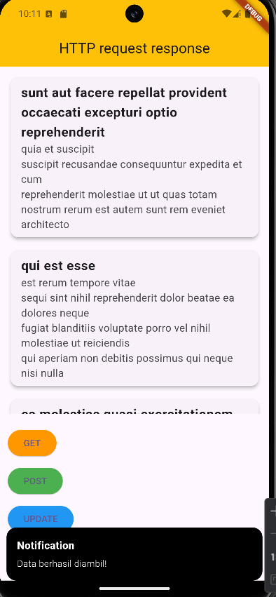
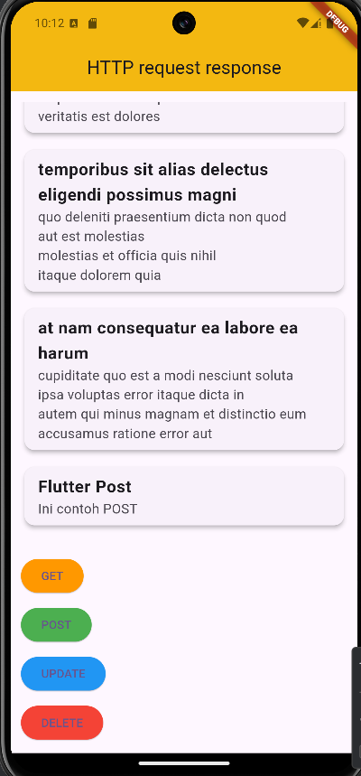
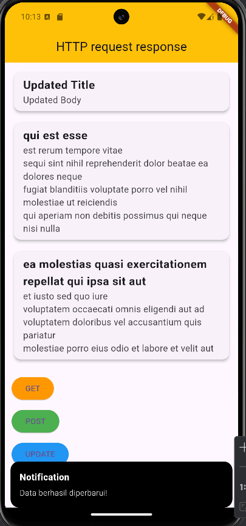

# Laporan Praktikum Pemrograman Perangkat Bergerak
## Data Storage (API)

Untuk menerapkan REST API dalam flutter, kita memerlukan package `http` untuk melakukan fungsi dari REST API yaitu `GET, POST, PUT, DELETE`. Di sini saya menggunakan `GetX` untuk state managementnya. Untuk API nya, saya akan menggunakan `https://jsonplaceholder.typicode.com/` untuk mencoba menerapkan REST API. Pertama buat file `api_service.dart` untuk melakukan fungsi dari REST API,  buat seperti berikut:
```dart
import 'dart:convert';
import 'package:http/http.dart' as http;

class ApiService {
  final String url = "https://jsonplaceholder.typicode.com";
  List<dynamic> posts = [];

  Future<void> fetchPosts() async {
    final response = await http.get(
      Uri.parse('$url/posts')
    );

    if (response.statusCode == 200){
      posts = json.decode(response.body);
    } else {
      throw Exception('Failed to posts');
    }
  }

  Future<void> createPost() async{
    final response = await http.post(
      Uri.parse('$url/posts'),
      headers: {'Content-Type': 'application/json'},
      body: json.encode({
        'title': 'Flutter post',
        'body': 'Ini contoh POST',
        'userId': 1
      })
    );

    if (response.statusCode == 201){
      posts.add({
        'title': 'Flutter Post',
        'body': 'Ini contoh POST',
        'userId': 1,
        'id': posts.length + 1
      });
    } else {
      throw Exception('Failed to create post');
    }
  }

  Future<void> updatePost() async {
    final response = await http.put(
      Uri.parse('$url/posts/1'),
      body: json.encode({
        'title': 'Updated Title',
        'body': 'Updated Body',
        'userId': 1,
      }),
    );
    if (response.statusCode == 200) {
      final updatedPost = posts.firstWhere((post) => post['id'] == 1);
      updatedPost['title'] = 'Updated Title';
      updatedPost['body'] = 'Updated Body';
    } else {
      throw Exception('Failed to update post');
    }
  }

  Future<void> deletePost() async {
    final response = await http.delete(
      Uri.parse('$url/posts/1'),
    );
    if (response.statusCode == 200) {
      posts.removeWhere((post) => post['id'] == 1);
    } else {
      throw Exception('Failed to delete post');
    }
  }
}
```

Kita menggunakan fungsi get, post, put, delete dari package http yang telah kita import untuk melakukan fungsi2 tersebut. Sekarang buat kontroller untuk menerapkan logika yang akan dilakukan dengan GetX.
```dart
import 'package:flutter/material.dart';
import 'package:get/get.dart';
import 'package:pertemuan14/App/API/api_service.dart';

class ApiController extends GetxController {
  var posts = <dynamic>[].obs;
  var isLoading = false.obs;
  final ApiService api = ApiService();

  void showSnackbar(String message) {
    Get.snackbar(
      'Notification',
      message,
      snackPosition: SnackPosition.BOTTOM,
      backgroundColor: Colors.black,
      colorText: Colors.white,
    );
  }

  Future<void> fetchPosts() async {
    await handleApiOperation(api.fetchPosts(), 'Data berhasil diambil!');
  }

  Future<void> createPost() async {
    await handleApiOperation(api.createPost(), 'Data berhasil ditambahkan!');
  }

  Future<void> updatePost() async {
    await handleApiOperation(api.updatePost(), 'Data berhasil diperbarui!');
  }

  Future<void> deletePost() async {
    await handleApiOperation(api.deletePost(), 'Data berhasil dihapus!');
  }

  Future<void> handleApiOperation(
      Future<void> operation, String successMessage) async {
    isLoading.value = true;
    try {
      await operation;
      posts.value = api.posts;
      showSnackbar(successMessage);
    } catch (e) {
      showSnackbar('Error: $e');
    } finally {
      isLoading.value = false;
    }
  }
}
```
Tujuan membuat kontroller di sini agar page yang akan menampilkan hasil dapat menggunakan `StatelessWidget` yang lebih hemat memori untuk load data. Sekarang buat Interface untuk menampilkan hasil dari REST API.
```dart
import 'package:flutter/material.dart';
import 'package:get/get.dart';
import 'package:pertemuan14/App/controllers/api_controller.dart';

import '../API/api_service.dart';

class HomePage extends StatelessWidget {
  HomePage({super.key});
  ApiController controller = Get.put(ApiController());
  final ApiService api = ApiService();

  @override
  Widget build(BuildContext context) {
    return Scaffold(
      appBar: AppBar(
        title: Text('HTTP request response'),
        centerTitle: true,
        backgroundColor: Colors.amber,
      ),
      body: Padding(
        padding: const EdgeInsets.all(12),
        child: Obx(
            () {
              return Column(
                crossAxisAlignment: CrossAxisAlignment.start,
                children: [
                  controller.isLoading.value
                      ? const Center(child: CircularProgressIndicator())
                      : controller.posts.isEmpty
                      ? const Text(
                    "Tekan tombol GET untuk mengambil data",
                    style: TextStyle(fontSize: 12),
                  )
                      : Expanded(
                    child: ListView.builder(
                      itemCount: controller.posts.length,
                      itemBuilder: (context, index) {
                        return Padding(
                          padding: const EdgeInsets.only(bottom: 12.0),
                          child: Card(
                            elevation: 4,
                            child: ListTile(
                              title: Text(
                                controller.posts[index]['title'],
                                style: const TextStyle(
                                    fontWeight: FontWeight.bold,
                                    fontSize: 20),
                              ),
                              subtitle: Text(
                                controller.posts[index]['body'],
                                style: const TextStyle(fontSize: 16),
                              ),
                            ),
                          ),
                        );
                      },
                    ),
                  ),
                  const SizedBox(height: 20),
                  ElevatedButton(
                    onPressed: () => controller.fetchPosts(),
                    style: ElevatedButton.styleFrom(backgroundColor: Colors.orange),
                    child: const Text('GET'),
                  ),
                  const SizedBox(height: 10),
                  ElevatedButton(
                    onPressed: () => controller.createPost(),
                    style: ElevatedButton.styleFrom(backgroundColor: Colors.green),
                    child: const Text('POST'),
                  ),
                  const SizedBox(height: 10),
                  ElevatedButton(
                    onPressed: () => controller.updatePost(),
                    style: ElevatedButton.styleFrom(backgroundColor: Colors.blue),
                    child: const Text('UPDATE'),
                  ),
                  const SizedBox(height: 10),
                  ElevatedButton(
                    onPressed: () => controller.deletePost(),
                    style: ElevatedButton.styleFrom(backgroundColor: Colors.red),
                    child: const Text('DELETE'),
                  ),
                ],
              );
            }
        ),
      ),
    );
  }
}
```

Fungsi dari REST API akan dilakukan ketika menekan tombol yang ada di tampilan, seperti GET untuk mengambil data menggunakan API, POST untuk menambahkan data, PUT untuk mengupdate data tertentu, dan DELETE untuk mengupdate data tertentu.

Hasil output:
GET
<div>
    
</div>

POST:
<div>
    
</div>

PUT:
<div>
    
</div>

DELETE:
<div>
    
</div>